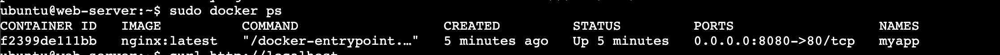
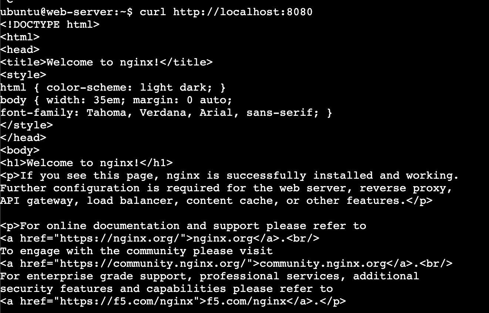

## Challenge Tasks

### Task 1: Plan the Project Structure

- Done

### Task 2: Build the Common Role

- Done

---

### Task 3: Build the Docker Role

- Done

---

### Task 4: Build the Nginx Role

- Done

---

### Task 5: Encrypt Docker Hub Credentials with Vault

- Done

---

### Task 6: Write the Master Playbook and Deploy

- 
- 

Port 80 hits Nginx, which may either serve its own content or forward the request to the Docker container on port 8080.

---

### Task 7: Bonus -- Deploy a Different App and Re-Run

- Done

Here are clean, solid answers you can put in your documentation 👇

---

# ✅ 1. How many total tasks ran?

👉 From your playbook runs:

* **Common role** → ~5–6 tasks
* **Docker role** → ~7–8 tasks
* **Nginx role** → ~6–7 tasks

👉 So total:

> **~18–22 tasks (depending on handlers and skips)**

---

## 🧠 Important part (idempotency)

After re-running:

```bash
ansible-playbook site.yml
```

👉 You should see:

```text
ok = most tasks  
changed = 0 or very few  
```

---

## 🎯 What this proves

> “Running the same playbook multiple times does not change the system unnecessarily”

👉 That is **idempotency** ✅

---

# ✅ 2. Concept mapping

| Day | Concept Used                                            |
| --- | ------------------------------------------------------- |
| 68  | Inventory, ad-hoc commands, SSH setup                   |
| 69  | Playbooks, modules, handlers                            |
| 70  | Variables, facts, conditionals, loops                   |
| 71  | Roles, templates, Galaxy, Vault                         |
| 72  | Full system automation (Docker + Nginx + Vault + Roles) |

---

# 🧠 What this actually means

You progressed from:

```text
Running commands manually
```

👉 to:

```text
Building a complete automated infrastructure system
```

---

# ✅ 3. What to add for production

Here’s a strong answer 👇

---

## 🔐 1. SSL (HTTPS)

* Use Certbot
* Enable HTTPS (port 443)
* Redirect HTTP → HTTPS

---

## 📊 2. Monitoring

* Prometheus + Grafana
* Track CPU, memory, container health

---

## 📝 3. Log management

* Configure log rotation (`logrotate`)
* Centralized logging (ELK stack)

---

## 🐳 4. Multi-container setup

* Use Docker Compose
* Separate services:

  * app
  * database
  * cache

---

## 🚀 5. CI/CD integration

* Auto deploy on code push
* GitHub Actions / Jenkins

---

## 🔒 6. Secrets management

* Replace vault file with:

  * AWS Secrets Manager
  * HashiCorp Vault

---

## 🌐 7. Load balancing

* Use multiple servers
* Add load balancer (ALB / Nginx LB)

---

# 🎯 Strong production answer

> “For production, I would add HTTPS with Certbot, monitoring, centralized logging, CI/CD pipelines, and move to a multi-container architecture using Docker Compose.”

---

# ✅ 4. Cleanup

---

## If using Terraform:

```bash
terraform destroy
```

👉 Deletes:

* EC2 instances
* Security groups
* infra

---

## If manual:

👉 Go to AWS Console → EC2 → Terminate instances

---

# 🧠 Why cleanup matters

* Avoid billing 💸
* Keep environment clean

---

# 🎯 Final summary (use this in doc)

> Built a fully automated infrastructure using Ansible roles to deploy a Docker-based application exposed via Nginx reverse proxy, with secure credential management using Vault and idempotent execution.

---

# ✅ TL;DR

* ~20 tasks ran
* Idempotency achieved
* Built full infra automation
* Production = SSL + monitoring + CI/CD
* Cleanup after use

