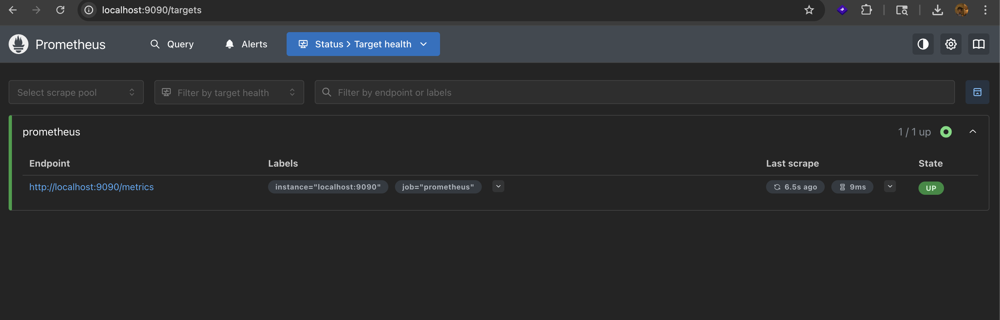
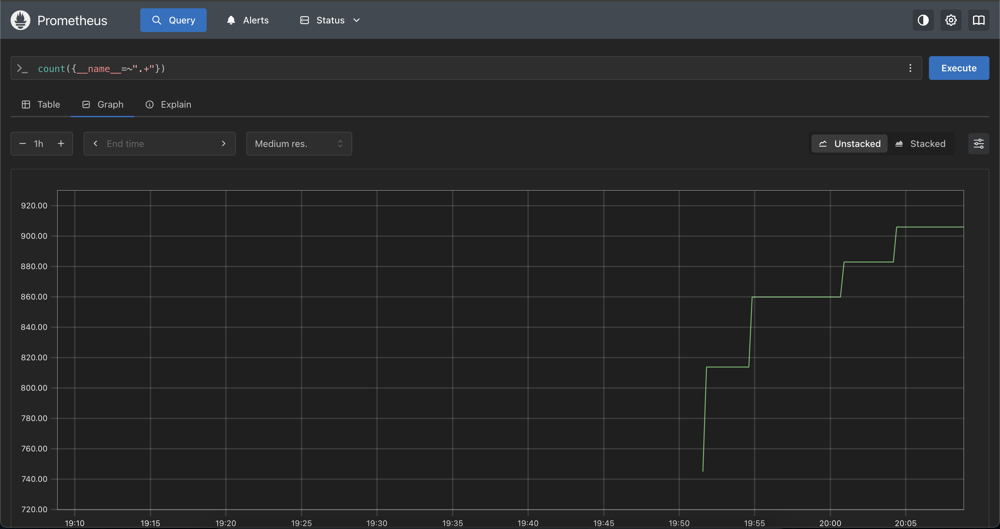
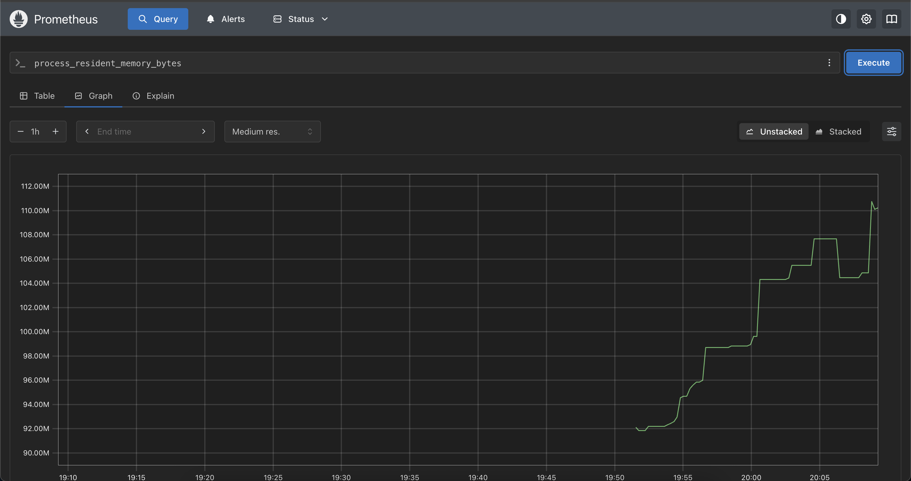
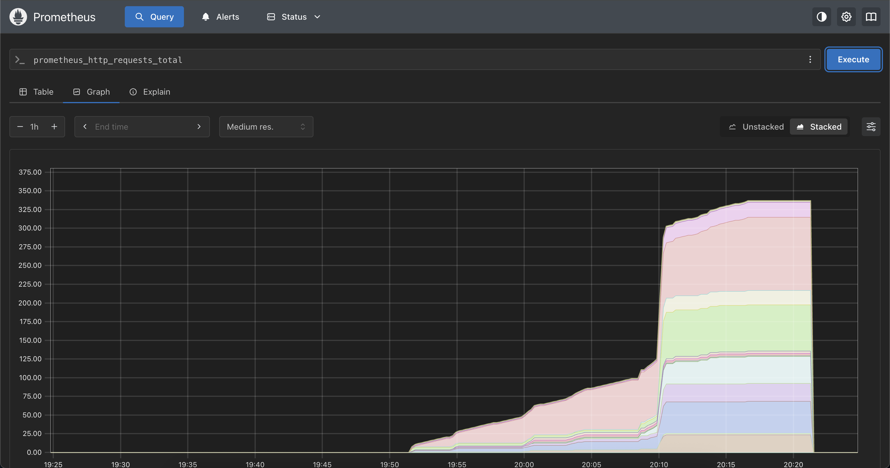
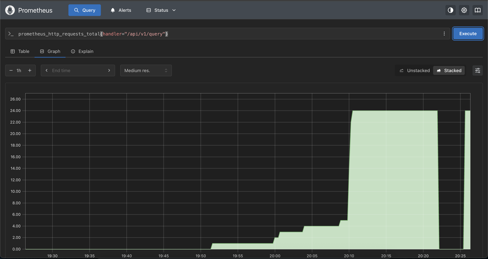
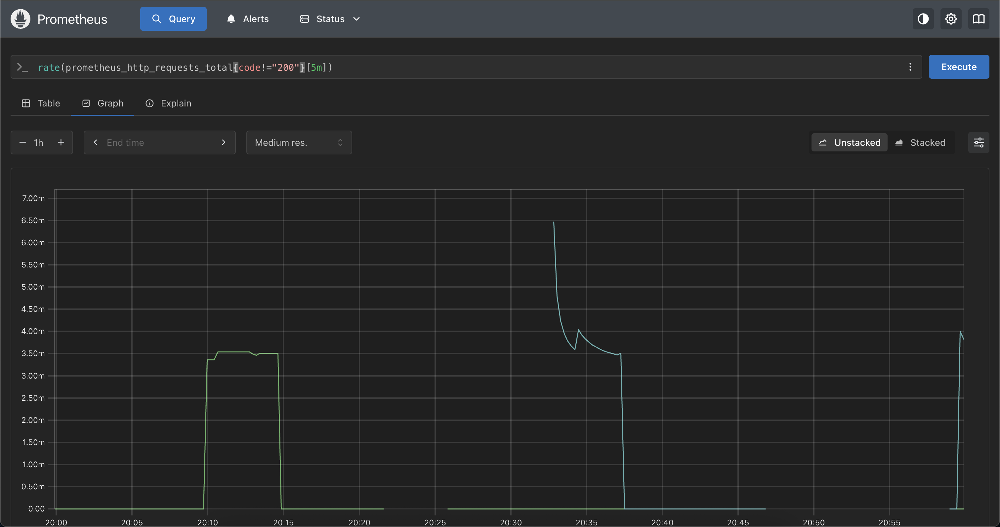
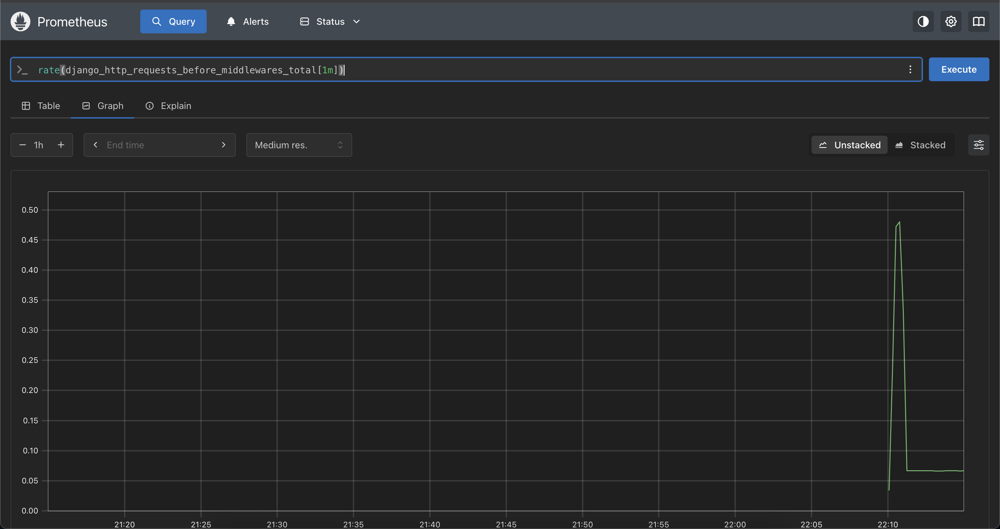
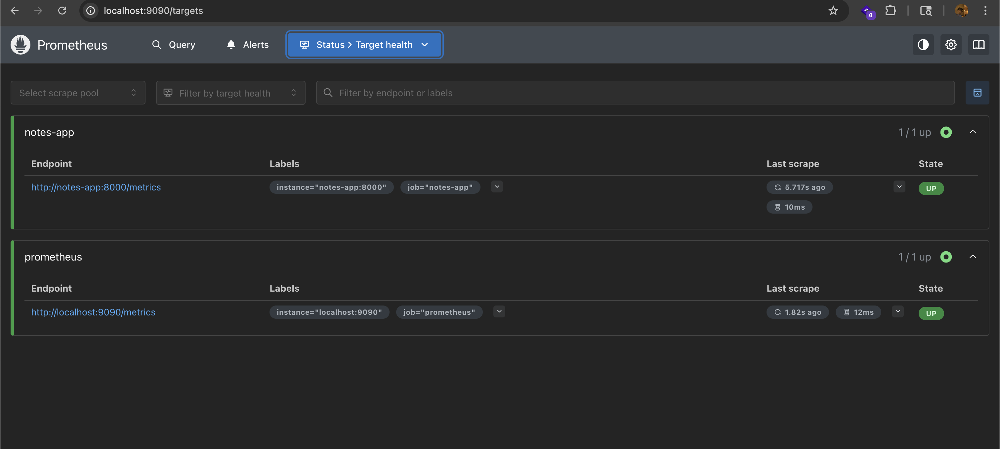
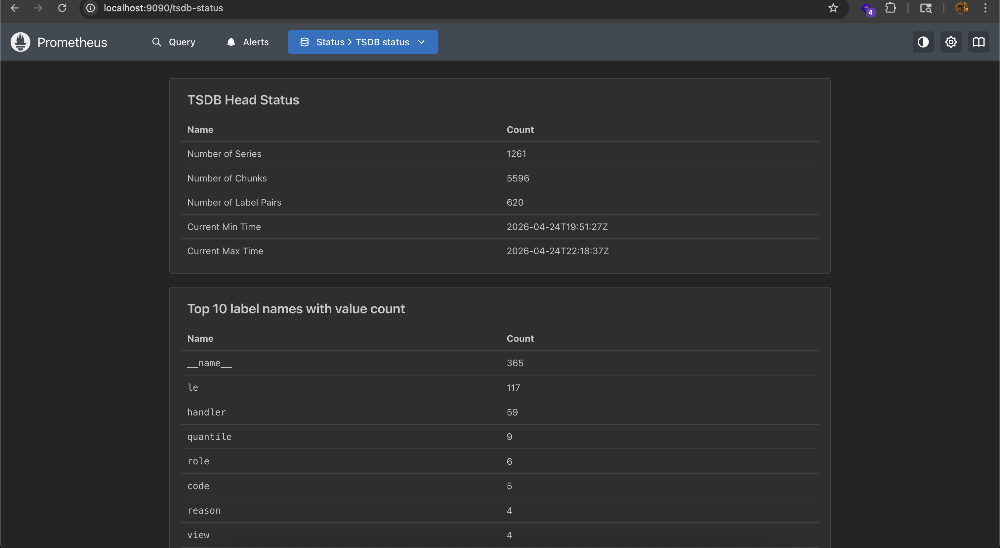

## Challenge Tasks

### Task 1: Understand Observability

Here’s a **clear, beginner → practical understanding** of observability, written in a way you can actually use while building systems 👇

---

# 🚀 1. What is Observability?

**Observability** means:
👉 *How well you can understand what’s happening inside your system just by looking at its outputs.*

Think of it like this:

* If your app crashes and you **don’t know why** → ❌ not observable
* If your app crashes and you can **quickly find the cause** → ✅ observable

### 🔍 Monitoring vs Observability

| Monitoring                     | Observability                       |
| ------------------------------ | ----------------------------------- |
| Tells **WHEN** something broke | Tells **WHY** it broke              |
| Based on alerts & thresholds   | Based on deep analysis              |
| Static dashboards              | Exploratory debugging               |
| Example: CPU > 90% alert       | Example: DB query causing CPU spike |

👉 Simple analogy:

* Monitoring = “Your car engine light is ON”
* Observability = “The fuel injector is failing due to pressure imbalance”

---

# 🧱 2. The Three Pillars of Observability

These are the **core data types** you collect to understand your system.

---

## 📊 Metrics (Numbers over time)

Metrics are **numerical values tracked continuously**.

Examples:

* CPU usage = 75%
* Requests per second = 1200
* Error rate = 3%

👉 Best for:

* Dashboards
* Alerts
* Trends

### Common Tools:

* Prometheus
* Datadog
* Amazon CloudWatch

💡 Example:

> “Error rate suddenly increased from 1% → 20%”

You know something is wrong… but not why.

---

## 📜 Logs (Event records)

Logs are **text-based records of events** happening in your system.

Examples:

```
2026-04-25 10:21:45 ERROR Database timeout
2026-04-25 10:21:46 User login failed
```

👉 Best for:

* Debugging errors
* Seeing exact failures
* Understanding sequence of events

### Common Tools:

* Grafana Loki
* ELK Stack
* Fluentd

💡 Example:

> “DB connection timed out after 5 seconds”

Now you know **why** something failed.

---

## 🔗 Traces (Request journey)

Traces show **how a single request travels across services**.

Example:

```
User Request → API Gateway → Auth Service → Payment Service → DB
```

👉 Best for:

* Microservices debugging
* Latency tracking
* Finding bottlenecks

### Common Tools:

* OpenTelemetry
* Jaeger
* Zipkin

💡 Example:

> “Payment service took 12 seconds → root cause of delay”

Now you know **where** it broke.

---

# 🧠 3. Why DevOps Engineers Need All Three

Using only one is like debugging blind.

### 🔴 If you only have Metrics:

* You know **something is wrong**
* But no clue why

### 🔴 If you only have Logs:

* Too much data
* Hard to find patterns

### 🔴 If you only have Traces:

* Only useful for request-level debugging

---

### ✅ Together they give full picture:

| Pillar  | Answers           |
| ------- | ----------------- |
| Metrics | WHAT is wrong     |
| Logs    | WHY it happened   |
| Traces  | WHERE it happened |

👉 Real-world example:

1. Metrics:

   * `/api/users` error rate = 30%

2. Logs:

   * `Database timeout error`

3. Traces:

   * Slow query in User Service

💥 Final conclusion:

> DB is slow → causing API failures

---

# 🏗️ 4. Observability Architecture (What You’ll Build)

Let’s break this system down step-by-step.

---

## 🔄 Full Flow (Simplified)

```
Your App → Metrics → Prometheus → Grafana
Your App → Logs → Promtail → Loki → Grafana
Your App → Traces → OTEL → Grafana
System → Metrics → Node Exporter → Prometheus
Docker → Metrics → cAdvisor → Prometheus
```

---

## 🧩 Components Explained

---

### 🖥️ Your Application

This is your:

* Backend (Node.js, Python, etc.)
* Microservices

It generates:

* Metrics
* Logs
* Traces

---

### 📊 Metrics Pipeline

```
App → Prometheus → Grafana
```

* Prometheus collects metrics
* Grafana visualizes dashboards

💡 Example:

* CPU usage graph
* API latency graph

---

### 📜 Logs Pipeline

```
App → Promtail → Loki → Grafana
```

* Promtail collects logs
* Grafana Loki stores logs
* Grafana helps you search logs

💡 Example:

* Search “ERROR”
* See logs from specific time

---

### 🔗 Traces Pipeline

```
App → OTEL Collector → Grafana
```

* OpenTelemetry collects traces
* Sent to backend (Jaeger/Grafana)

💡 Example:

* See full request lifecycle
* Identify slow services

---

### 🖥️ Host Monitoring

```
Node Exporter → Prometheus
```

* Node Exporter collects:

  * CPU
  * RAM
  * Disk

---

### 🐳 Docker Monitoring

```
cAdvisor → Prometheus
```

* cAdvisor tracks:

  * Container CPU
  * Memory
  * Network

---

# 🧠 Final Mental Model (Very Important)

Think of observability like a **doctor diagnosing a patient**:

* Metrics → Heart rate (something is wrong)
* Logs → Blood test (what’s wrong)
* Traces → MRI scan (where exactly the issue is)

👉 Without all three → incomplete diagnosis
👉 With all three → fast root cause analysis

---

# ⚡ Quick Summary (Revision)

* Observability = understanding system behavior deeply
* Monitoring = alerts, Observability = insights
* 3 pillars:

  * Metrics → numbers
  * Logs → events
  * Traces → request path
* All three together = full debugging power
* Stack you’ll build:

  * Prometheus + Grafana (metrics)
  * Loki + Promtail (logs)
  * OpenTelemetry (traces)

---

### Task 2: Set Up Prometheus with Docker

- 

---

### Task 3: Understand Prometheus Concepts

- 
- 
- 
- 

**Document:** What is the difference between a counter and a gauge? Give one real-world example of each.

| Counter                 | Gauge                    |
| ----------------------- | ------------------------ |
| Only increases          | Can increase & decrease  |
| Represents total events | Represents current value |
| Resets only on restart  | Changes anytime          |

```

✅ Real-world Examples
Counter Example:
total_orders_processed
→ Always increases as more orders come in
Gauge Example:
current_active_users
→ Goes up when users join, down when they leave

```
---
### Task 4: Learn PromQL Basics
- 

`rate(prometheus_http_requests_total{code!="200"}[5m])`


### Task 5: Add a Sample Application as a Scrape Target



---

### Task 6: Explore Data Retention and Storage

- docker exec prometheus du -sh /prometheus

`2.7M    /prometheus`

- 
- 


Here’s a clear, beginner → practical explanation you can submit 👇

---

# 🧠 What happens when retention is exceeded?

Prometheus stores data for a **fixed retention period** (default ~15 days, or whatever you configure).

👉 When this limit is reached:

* ❌ Old data is **automatically deleted**
* ✅ New data continues to be stored
* 📉 Storage usage stays within limits

---

## 🔍 Simple explanation

Think of it like a rolling window:

```text
Day 1 → Day 15 → keep data
Day 16 → Day 1 gets deleted
Day 17 → Day 2 gets deleted
```

👉 So:

> Prometheus always keeps **recent data only**

---

## ⚡ Why this is done

* Prevent disk from filling up
* Keep queries fast
* Maintain predictable storage usage

---

# 💾 Why is a volume mount important?

By default, Docker containers are **ephemeral**:

👉 If container restarts:

* ❌ All stored metrics are lost

---

## ✅ With volume mount

```yaml
volumes:
  - prometheus_data:/prometheus
```

👉 This means:

* Data is stored **outside the container**
* Survives:

  * container restart
  * container recreation

---

## 🔍 Without volume

```text
Restart container → ALL metrics gone ❌
```

---

## 🔍 With volume

```text
Restart container → metrics still there ✅
```

---

# 🧠 Real-world analogy

* Retention = “keep last 15 days of CCTV footage”
* Volume mount = “store footage on hard drive, not temporary memory”

---

# ⚡ Final Answer (Short Version)

* When retention is exceeded, Prometheus **deletes older metrics automatically** to make space for new data.
* A volume mount is important because it ensures **data persists across container restarts**, preventing loss of collected metrics.

