## Challenge Tasks

### Task 1: Add Node Exporter for Host Metrics

```
curl http://localhost:9100/metrics | head -20
  % Total    % Received % Xferd  Average Speed   Time    Time     Time  Current
                                 Dload  Upload   Total   Spent    Left  Speed
  0     0    0     0    0     0      0      0 --:--:-- --:--:-- --:--:--     0# HELP go_gc_duration_seconds A summary of the wall-time pause (stop-the-world) duration in garbage collection cycles.
# TYPE go_gc_duration_seconds summary
go_gc_duration_seconds{quantile="0"} 9.167e-06
go_gc_duration_seconds{quantile="0.25"} 9.167e-06
go_gc_duration_seconds{quantile="0.5"} 2.1167e-05
go_gc_duration_seconds{quantile="0.75"} 2.6291e-05
go_gc_duration_seconds{quantile="1"} 2.6291e-05
go_gc_duration_seconds_sum 5.6625e-05
go_gc_duration_seconds_count 3
# HELP go_gc_gogc_percent Heap size target percentage configured by the user, otherwise 100. This value is set by the GOGC environment variable, and the runtime/debug.SetGCPercent function. Sourced from /gc/gogc:percent.
# TYPE go_gc_gogc_percent gauge
go_gc_gogc_percent 100
# HELP go_gc_gomemlimit_bytes Go runtime memory limit configured by the user, otherwise math.MaxInt64. This value is set by the GOMEMLIMIT environment variable, and the runtime/debug.SetMemoryLimit function. Sourced from /gc/gomemlimit:bytes.
# TYPE go_gc_gomemlimit_bytes gauge
go_gc_gomemlimit_bytes 9.223372036854776e+18
# HELP go_goroutines Number of goroutines that currently exist.
# TYPE go_goroutines gauge
go_goroutines 8
# HELP go_info Information about the Go environment.
# TYPE go_info gauge
100 32496    0 32496    0     0   934k      0 --:--:-- --:--:-- --:--:--  961k
curl: (23) Failure writing output to destination, passed 783 returned 0
```

# CPU: percentage of time spent idle (per core)
- 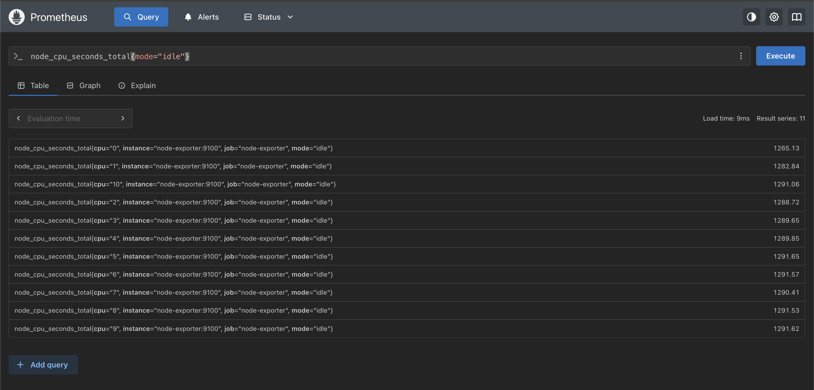

# Memory: total vs available
- 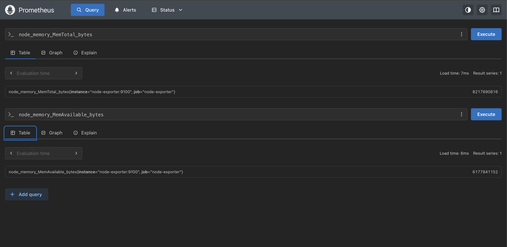

# Memory usage percentage

- 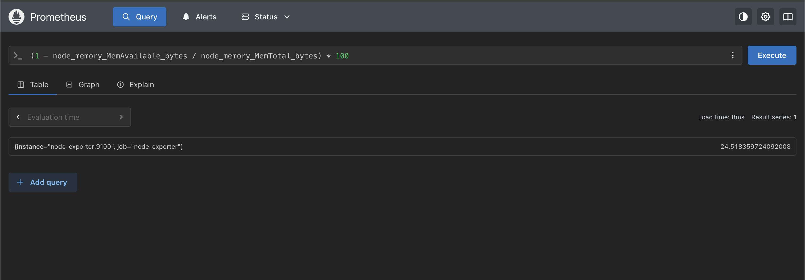

# Disk: filesystem usage percentage

- 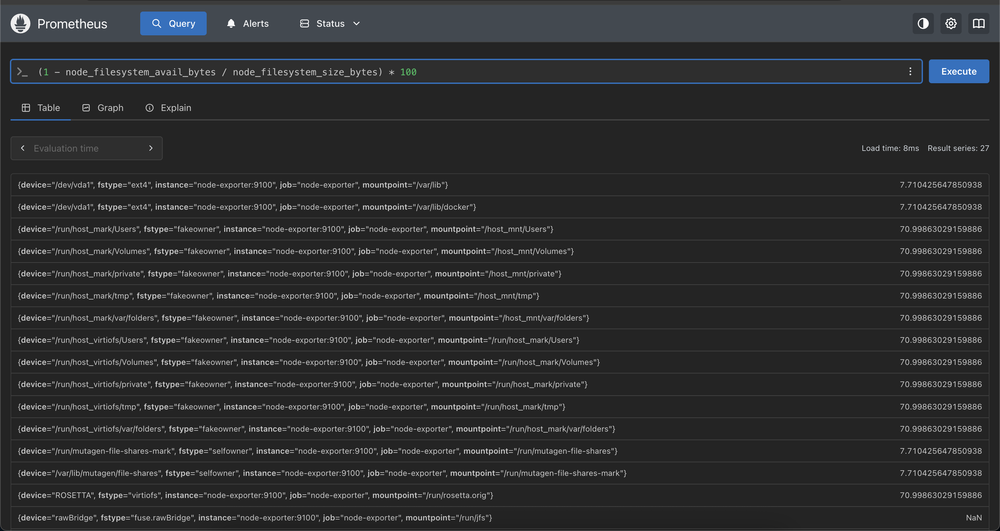

- ![rate(node_network_receive_bytes_total[5m])](image-4.png)

---

### Task 2: Add cAdvisor for Container Metrics

`rate(container_cpu_usage_seconds_total{id!="/"}[5m])`

- 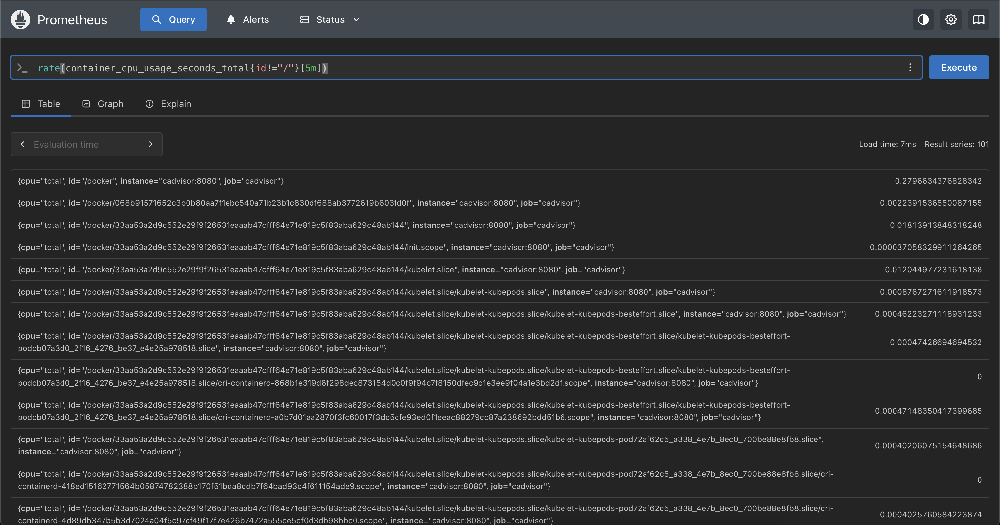

`container_memory_usage_bytes{name!=""}`

- 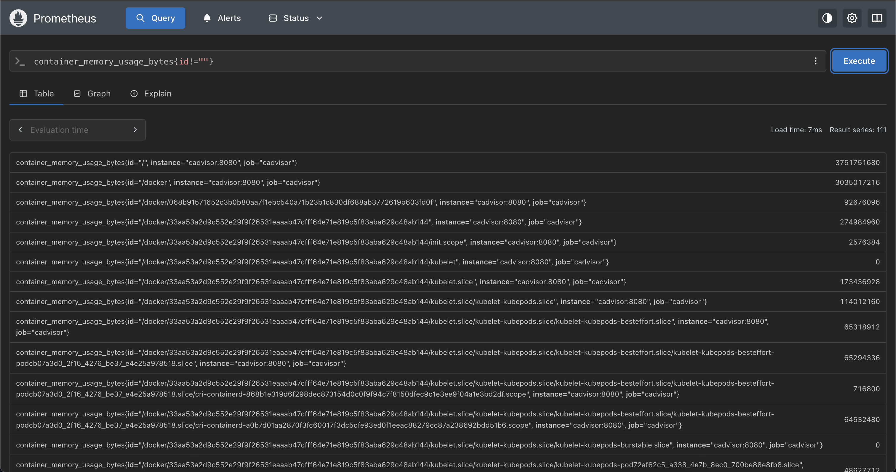

`rate(container_network_receive_bytes_total{id!=""}[5m])`

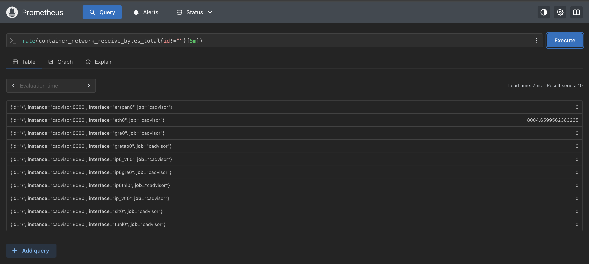

`topk(3, container_memory_usage_bytes{id!=""})`

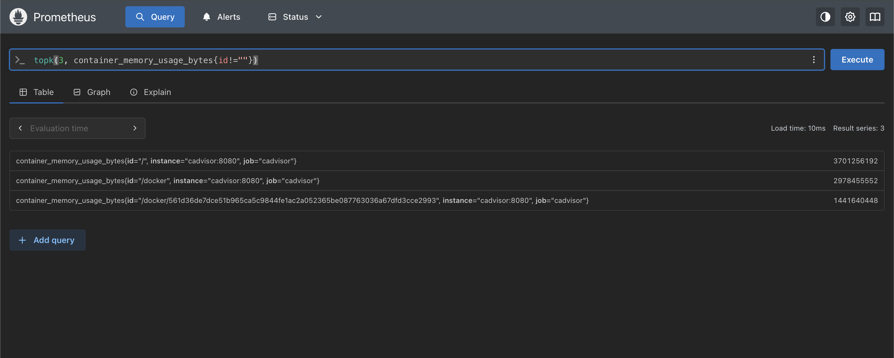


You’ve got the core idea right 👍 — just tighten it a bit so it sounds solid and complete.

---
**Document:** What is the difference between Node Exporter and cAdvisor? When would you use each?

## 🧠 Difference between Node Exporter and cAdvisor

### 🔹 node_exporter

* Monitors the **host machine (system level)**
* Gives metrics like:

  * CPU usage
  * Memory usage
  * Disk space
  * Network stats
* Works by reading:

  * `/proc`, `/sys`, etc.

👉 Think:

> “How healthy is my server?”

---

### 🔹 cAdvisor

* Monitors **Docker containers**
* Gives metrics like:

  * CPU per container
  * Memory per container
  * Network per container
* Uses Docker + cgroups info

👉 Think:

> “Which container is causing load?”

---

## ⚔️ Key Difference

| Feature  | Node Exporter    | cAdvisor                    |
| -------- | ---------------- | --------------------------- |
| Scope    | Host (machine)   | Containers                  |
| Level    | System-level     | Application/container-level |
| Use case | Infra monitoring | Container monitoring        |

---

## 🎯 When to use each

### ✅ Use Node Exporter when:

* You want to monitor:

  * Server CPU spikes
  * Memory exhaustion
  * Disk usage
* Example:

  > “Why is my server slow?”

---

### ✅ Use cAdvisor when:

* You want to monitor:

  * Which container is using most CPU
  * Memory leaks in a service
* Example:

  > “Which container is causing the issue?”

---

## 🧠 Best practice (important)

👉 In real setups, you use **both together**

* Node Exporter → tells you *something is wrong*
* cAdvisor → tells you *who is responsible*

---

## ✅ Clean version you can submit

You can write this:

> Node Exporter is used to monitor host-level system metrics like CPU, memory, disk, and network usage of the machine where Docker is running.
> cAdvisor is used to monitor container-level metrics such as CPU, memory, and network usage of individual Docker containers.
>
> Node Exporter helps understand overall system health, while cAdvisor helps identify which specific container is consuming resources. In production, both are used together for complete observability.

---

### Task 3: Set Up Grafana

- 

---
### Task 4: Build Your First Dashboard
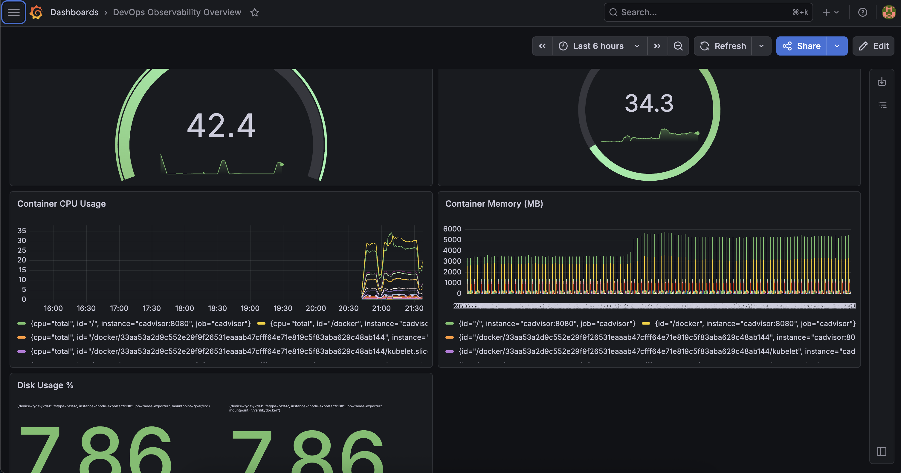

---

### Task 5: Auto-Provision Datasources with YAML
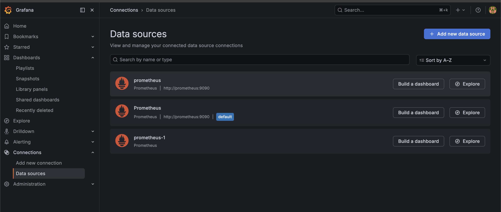


Here’s a clean, solid answer you can submit 👇

---
**Document:** Why is provisioning datasources via YAML better than configuring them manually through the UI?

## 🧠 Why provisioning datasources via YAML is better than manual UI setup

Provisioning datasources using YAML (configuration files) is preferred over manual UI setup because it is **automated, consistent, and scalable**.

---

### 🔹 1. Automation (No manual work)

* YAML lets you define datasources once
* Automatically loaded when Grafana starts

👉 No need to:

* Click through UI
* Reconfigure every time

---

### 🔹 2. Consistency across environments

* Same config works in:

  * local
  * staging
  * production

👉 Prevents:

> “Works on my machine” issues

---

### 🔹 3. Version control (VERY important)

* YAML files can be stored in Git

👉 You get:

* history of changes
* easy rollback
* team collaboration

---

### 🔹 4. Faster setup & scaling

* Spin up new environments instantly
* Especially useful in:

  * Docker
  * Kubernetes

👉 Just start container → datasource is ready

---

### 🔹 5. Infrastructure as Code (best practice)

* Everything is defined as code
* No hidden manual configs

👉 Makes system:

* reproducible
* reliable

---

## ⚖️ Manual UI setup vs YAML

| Feature         | UI Setup | YAML Provisioning |
| --------------- | -------- | ----------------- |
| Speed           | ❌ slow   | ✅ instant         |
| Repeatability   | ❌ manual | ✅ automatic       |
| Version control | ❌ none   | ✅ Git             |
| Scalability     | ❌ poor   | ✅ excellent       |

---

## 🎯 Final Answer (short version)

> Provisioning datasources via YAML is better than manual UI configuration because it enables automation, consistency, and version control. It allows teams to define configurations as code, making setups reproducible, faster to deploy, and easier to manage across multiple environments.

---

### Task 6: Import a Community Dashboard

- 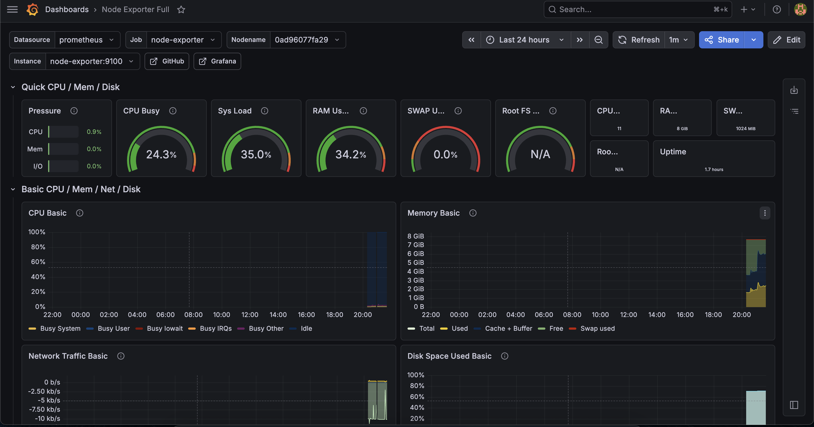
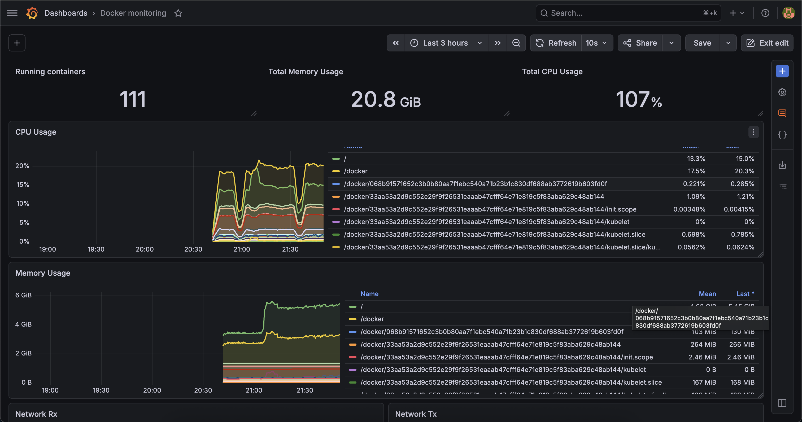

---