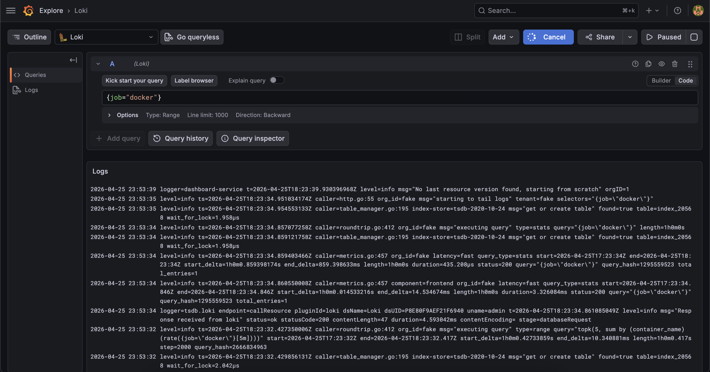
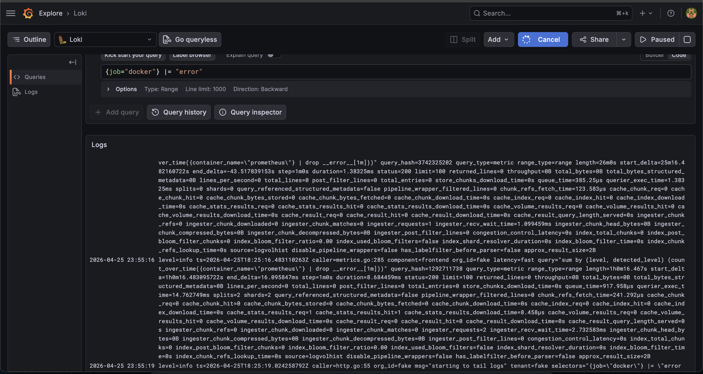
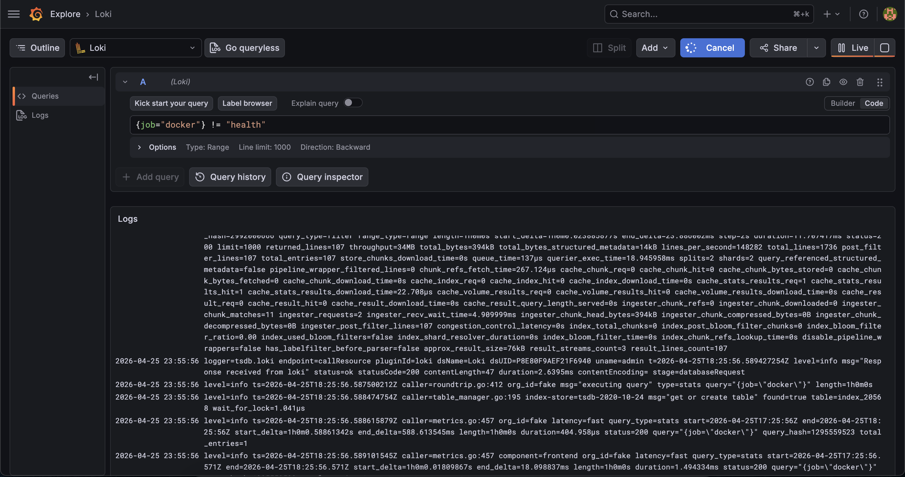
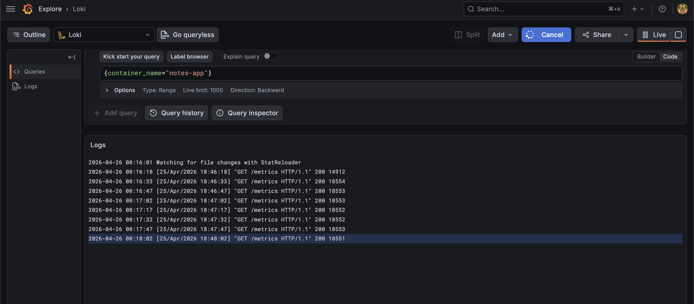
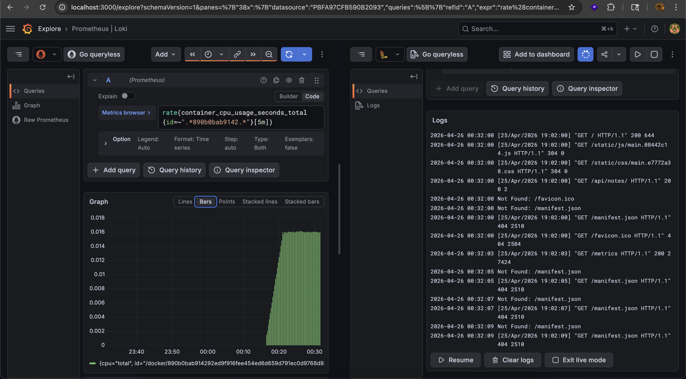

## Challenge Tasks

### Task 1: Understand the Logging Pipeline

Here’s a clean, solid answer you can submit 👇

---

## 🧠 Why does Loki only index labels instead of full text?

Grafana Loki is designed to be **cost-efficient and scalable**, so it **indexes only labels (metadata)** instead of the entire log content.

### 🔹 Why labels only?

* Logs can be **huge (GBs–TBs per day)**
* Full-text indexing (like Elasticsearch) is:

  * expensive 💸
  * storage-heavy
  * slower to scale

👉 Loki avoids this by:

* Indexing only labels (e.g., `app`, `container`, `level`)
* Storing raw logs separately (cheap object storage)

---

## ⚖️ Trade-off

### ✅ Advantages

* Much **lower storage cost**
* Faster ingestion (write speed)
* Easier to scale
* Simpler architecture

---

### ❌ Disadvantages

* No fast full-text search ❗
* Queries must rely on:

  * labels first
  * then filter logs

👉 Example:

```logql
{container="nginx"} |= "error"
```

* First → filter by label (`container`)
* Then → search text (`error`) → slower

---

## 🎯 Summary

> Loki indexes only labels to reduce cost and improve scalability. The trade-off is that full-text searches are slower compared to systems that index entire logs, but Loki achieves much better performance and efficiency at scale.

---

## 🧠 One-line takeaway

> Loki trades **search power** for **cost and scalability**

---

### Task 2: Add Loki to the Stack

- 

---

### Task 3: Add Promtail to Collect Container Logs

`for i in $(seq 1 20); do curl -s http://localhost:8000 > /dev/null; done`

---

### Task 4: Add Loki as a Grafana Datasource

- Done with Option A

---

### Task 5: Query Logs with LogQL

- 1. 
- 2. 
- 3. 
- 4. 
- 5.  [{job="docker"} |~ "status=[45]\\d{2}"](image-1.png)
- 6. 
- 7. 
- 8. 

**Exercise:** Write a LogQL query that finds all error logs from the notes-app container in the last 1 hour. Then write another query that counts how many error lines per minute.

`{container_name="notes-app"} |= "error"`
`count_over_time({container_name="notes-app"} |= "error" [1m])`

---

### Task 6: Correlate Metrics and Logs in Grafana

- 

Here’s a clean, solid answer you can submit 👇

---

**Document:** How does having metrics and logs in the same tool (Grafana) help during incident response compared to checking separate systems?

## 🧠 How Grafana (metrics + logs together) helps in incident response

When both **metrics (Prometheus)** and **logs (Loki)** are available in Grafana, debugging becomes much faster and more efficient.

---

## 🚀 Key advantages

### 1️⃣ Faster root cause analysis

* You see a spike in CPU/memory (metrics)
* Immediately jump to related logs (same UI)

👉 No need to switch tools

---

### 2️⃣ Correlation becomes easy

* Metrics tell you **WHAT went wrong**
* Logs tell you **WHY it went wrong**

👉 Example:

* CPU spikes at 10:05
* Logs at 10:05 → “DB connection timeout”

---

### 3️⃣ Reduced context switching

* No switching between:

  * Prometheus UI
  * Kibana / other log tools

👉 Everything in one place → faster thinking

---

### 4️⃣ Time-synced debugging

* Same time range across:

  * graphs
  * logs

👉 You don’t manually align timestamps

---

### 5️⃣ Drill-down workflow

Typical flow:

1. Alert triggers (high CPU)
2. Open Grafana dashboard
3. Click → explore logs for that service
4. Identify exact error

👉 End-to-end in seconds

---

## ⚡ Compared to separate systems

| With Grafana (integrated) | Separate tools     |
| ------------------------- | ------------------ |
| One UI                    | Multiple UIs       |
| Instant correlation       | Manual correlation |
| Faster debugging          | Slower             |
| Less cognitive load       | More confusion     |

---

## 🎯 Real-world impact

* Faster MTTR (Mean Time To Repair)
* Less downtime
* Better on-call experience

---

## 🧠 One-line takeaway

> Having metrics and logs in the same tool lets you go from “something is wrong” to “this is exactly why” without leaving the dashboard.

---
