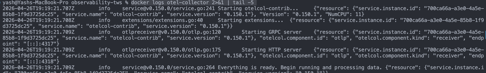
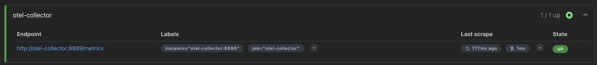
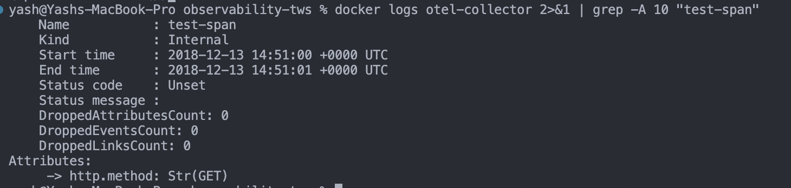
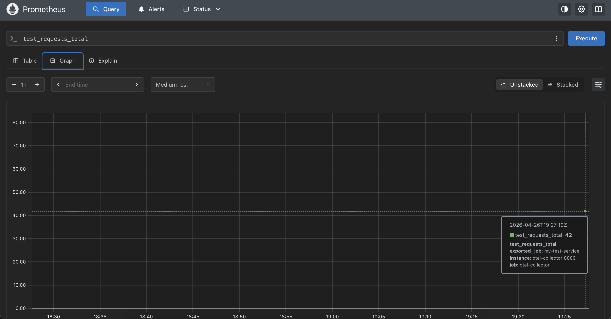
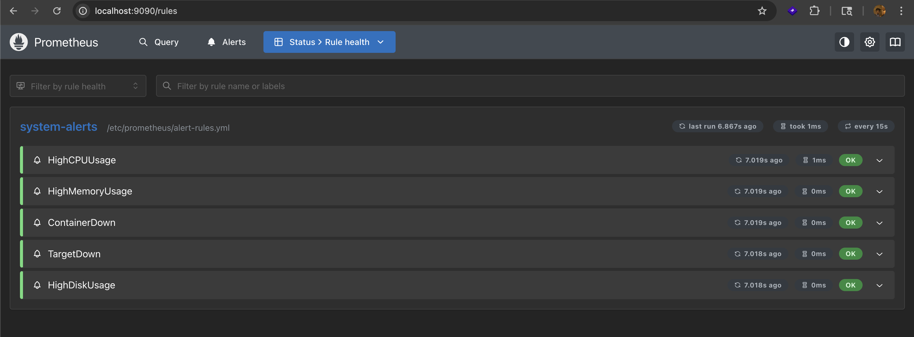
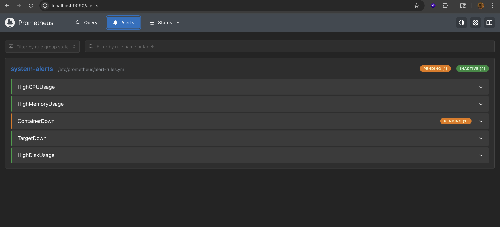
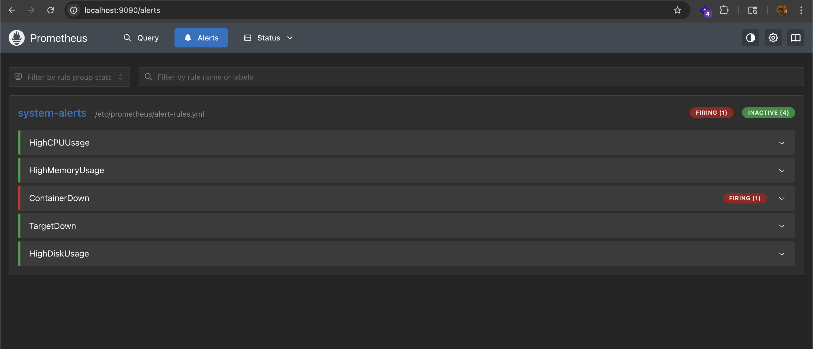
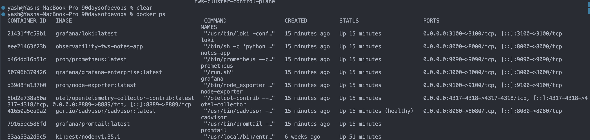

## Challenge Tasks

### Task 1: Understand OpenTelemetry

Alright — I’ll build this from **zero → clear mental model → real-world flow** so you actually *get* OpenTelemetry, not just memorize terms.

---

# 🧠 1. What problem does OpenTelemetry solve?

Imagine your app:

```
User → Frontend → API → Auth Service → DB → Payment Service
```

Now something breaks 😵

You ask:

* Why is it slow?
* Which service failed?
* Where exactly did the request get stuck?

Without observability:
👉 You’re guessing.

With observability:
👉 You *see everything happening inside your system*

---

# 🔍 Observability = 3 Pillars

### 1. Metrics (numbers over time)

* CPU usage
* Request count
* Error rate

👉 “Something is wrong”

---

### 2. Logs (events)

* Error messages
* Debug info

👉 “What went wrong”

---

### 3. Traces (request journey)

* Full path of a request across services

👉 “Where it went wrong”

---

# 🚀 2. What is OpenTelemetry (OTEL)?

**OpenTelemetry = a standard way to generate and send observability data**

👉 Think of it like:

> “A universal language + toolkit for observability”

### Key idea:

* It **collects data**
* It **does NOT store data**

---

### ❌ Not OpenTelemetry:

* Not a dashboard
* Not a database
* Not a monitoring tool

---

### ✅ What it actually is:

A framework that:

* Instruments your app
* Collects telemetry
* Sends it to tools like:

  * Prometheus (metrics)
  * Jaeger (traces)
  * Grafana Loki (logs)
  * Datadog

---

### 🔥 Real-world analogy:

OpenTelemetry = courier service 📦
Backends = warehouses 🏬

OTEL collects and delivers data, warehouses store and show it.

---

# ⚙️ 3. How OpenTelemetry works (simple flow)

```
Your App → OpenTelemetry SDK → OTEL Collector → Backend (Prometheus / Jaeger)
```

---

# 🧱 4. What is the OTEL Collector?

This is the **heart of the system**.

👉 A standalone service that handles telemetry data.

---

## 📦 Think of it like a data pipeline:

```
Receivers → Processors → Exporters
```

---

## 🔹 1. Receivers (Input)

They **accept data** from apps.

Examples:

* OTLP (native OTEL format)
* Prometheus metrics
* Jaeger traces

👉 Like: “entry gate”

---

## 🔹 2. Processors (Middle layer)

They **modify data before sending**

Examples:

* Batching (combine multiple logs)
* Sampling (keep only some traces)
* Filtering (remove useless data)

👉 Like: “data cleaning + optimization”

---

## 🔹 3. Exporters (Output)

They **send data to tools**

Examples:

* Prometheus
* Jaeger
* Logging/debug console

👉 Like: “delivery system”

---

## 🔥 Example flow:

```
App sends trace → Receiver gets it →
Processor batches it →
Exporter sends to Jaeger
```

---

# 🌐 5. What is OTLP?

**OTLP = OpenTelemetry Protocol**

👉 The *standard format* for sending telemetry data.

---

### Why OTLP exists:

Before OTEL:

* Every tool had different formats 😵
* Integration was messy

Now:
👉 OTLP = one standard for everything

---

### Supports:

* gRPC → port **4317**
* HTTP → port **4318**

---

### Simple idea:

```
App → OTLP → Collector → Backend
```

---

### Analogy:

OTLP is like **HTTP for observability data**

---

# 🔗 6. What are Distributed Traces?

This is where things get powerful.

---

## 🧠 Problem:

A request goes through multiple services.

You want:
👉 “Track the entire journey”

---

## 📌 Definition:

A **trace** = complete journey of one request

A **span** = one step in that journey

---

## 🔥 Example:

```
User logs in
```

Flow:

```
Frontend → API → Auth Service → Database
```

---

### Trace structure:

```
Trace ID: 123

Span 1: API Gateway
Span 2: Auth Service
Span 3: Database
```

---

## 📊 Each span contains:

* Trace ID (same for all spans)
* Span ID (unique)
* Parent Span ID
* Start time
* Duration
* Metadata (attributes)

---

## 🧩 Visual breakdown:

```
Trace (User Login)
│
├── Span 1 (API Gateway)
│     └── Span 2 (Auth Service)
│            └── Span 3 (Database)
```

---

## 💥 Why this matters:

You can answer:

* Which service is slow?
* Where is the bottleneck?
* Which call failed?

---

# 🚀 Full Real-World Example

Let’s say your app is slow.

---

### Without OTEL:

* Check logs manually 😵
* Guess root cause

---

### With OTEL:

1. Trace shows:

   * API: 20ms
   * Auth: 50ms
   * DB: **1200ms** ❗

👉 Problem = database

---

# 🧠 Final Mental Model

```
[ Your App ]
     ↓
(OpenTelemetry SDK)
     ↓
(OTEL Collector)
     ↓
Receivers → Processors → Exporters
     ↓
[ Backend Tools (Prometheus / Jaeger / Loki) ]
     ↓
[ Dashboards (Grafana) ]
```

---

# ⚡ One-line summaries

* **OpenTelemetry** → standard system to collect observability data
* **Collector** → pipeline that processes and routes data
* **OTLP** → protocol to send data
* **Trace** → full request journey
* **Span** → one step in that journey

---

### Task 2: Add the OpenTelemetry Collector

- `docker logs otel-collector 2>&1 | tail -5`


-

---

### Task 3: Send Test Traces to the Collector

- `docker logs otel-collector 2>&1 | grep -A 10 "test-span"`


- `test_requests_total`



```
The metric traveled: your curl command -> OTEL Collector (OTLP receiver) -> Prometheus exporter -> Prometheus scraped it. This is how OTEL bridges different telemetry formats.
```

---

### Task 4: Set Up Prometheus Alerting Rules

- 

- 

- 
---

### Task 5: Set Up Grafana Alerts


**Document:** What is the difference between Prometheus alerts and Grafana alerts? When would you use each?

Here’s a clean, concise answer you can submit 👇

---

## 📄 Difference between Prometheus alerts and Grafana alerts

### 🔴 Prometheus Alerts

* Defined using **YAML rules** (`alert-rules.yml`)
* Evaluated **inside Prometheus**
* Use **PromQL only**
* Require **Alertmanager** to send notifications
* More **reliable and production-grade**

👉 **Use when:**

* Monitoring infrastructure (CPU, memory, containers, Kubernetes)
* You want version-controlled, consistent alerts
* Critical system-level alerting

---

### 🟢 Grafana Alerts

* Created using **Grafana UI**
* Evaluated by **Grafana**
* Can use multiple data sources (Prometheus, Loki, etc.)
* Built-in notification system (email, Slack, etc.)
* Easier and faster to set up

👉 **Use when:**

* You want quick alerts from dashboards
* You need alerts combining multiple data sources
* For visualization-driven or exploratory alerting

---

## ⚡ Key Difference

```text
Prometheus → backend, YAML-based, production alert engine
Grafana → UI-based, flexible, visualization-driven alerting
```

---

## 🧠 Final Summary

* Prometheus alerts are **core, reliable, and used for critical monitoring**
* Grafana alerts are **easy, flexible, and great for quick or dashboard-based alerts**

👉 In real-world setups, both are often used together:

* Prometheus for **critical alerts**
* Grafana for **visual + quick alerts** 🚀

---

### Task 6: Review the Full Stack Architecture


```
                    METRICS PIPELINE
[Node Exporter] -----> [Prometheus] -----> [Grafana Dashboards]
[cAdvisor] ----------> [Prometheus] -----> [Grafana Dashboards]
[OTEL Collector:8889]> [Prometheus] -----> [Grafana Dashboards]
                                    -----> [Alert Rules -> Notifications]

                    LOGS PIPELINE
[Docker Containers] -> [Promtail] -> [Loki] -> [Grafana Explore/Dashboards]

                    TRACES PIPELINE
[curl/App OTLP] -----> [OTEL Collector] -> [Debug Output / Future: Jaeger/Tempo]
```

**Services running:**

| Service | Port | Purpose |
|---------|------|---------|
| Prometheus | 9090 | Metrics storage and querying |
| Node Exporter | 9100 | Host system metrics |
| cAdvisor | 8080 | Container metrics |
| Grafana | 3000 | Visualization and alerting |
| Loki | 3100 | Log storage |
| Promtail | 9080 | Log collection agent |
| OTEL Collector | 4317/4318/8889 | Telemetry collection |
| Notes App | 8000 | Sample a

`docker ps`
- 