## Challenge Tasks

### Task 1: Clone and Launch the Reference Stack

```
.
├── assets
│   ├── docker.png
│   ├── images
│   └── nodeexporter.png
├── docker-compose.yml
├── grafana
│   └── provisioning
│       ├── dashboards
│       │   └── dashboards.yml
│       └── datasources
│           └── datasources.yml
├── loki
│   └── loki-config.yml
├── notes-app
│   ├── api
│   │   ├── __init__.py
│   │   ├── admin.py
│   │   ├── apps.py
│   │   ├── migrations
│   │   │   ├── __init__.py
│   │   │   └── 0001_initial.py
│   │   ├── models.py
│   │   ├── serializers.py
│   │   ├── tests.py
│   │   ├── urls.py
│   │   └── views.py
│   ├── db.sqlite3
│   ├── Dockerfile
│   ├── Jenkinsfile
│   ├── manage.py
│   ├── mynotes
│   │   ├── db.json
│   │   ├── Dockerfile
│   │   ├── package-lock.json
│   │   ├── package.json
│   │   ├── public
│   │   │   ├── favicon.ico
│   │   │   ├── index.html
│   │   │   ├── logo192.png
│   │   │   ├── logo512.png
│   │   │   ├── manifest.json
│   │   │   └── robots.txt
│   │   └── src
│   │       ├── App.css
│   │       ├── App.js
│   │       ├── assets
│   │       │   ├── add.svg
│   │       │   ├── arrow-left.svg
│   │       │   ├── data.js
│   │       │   └── db.json
│   │       ├── components
│   │       │   ├── AddButton.js
│   │       │   ├── header.js
│   │       │   └── ListItem.js
│   │       ├── index.js
│   │       └── pages
│   │           ├── NotePage.js
│   │           └── NotesListPage.js
│   ├── notesapp
│   │   ├── __init__.py
│   │   ├── asgi.py
│   │   ├── settings.py
│   │   ├── urls.py
│   │   └── wsgi.py
│   ├── procfile
│   └── requirements.txt
├── otel-collector
│   └── otel-collector-config.yml
├── prometheus.yml
├── promtail
│   └── promtail-config.yml
└── README.md

```


- `docker compose`

```
NAME             IMAGE                                         COMMAND                  SERVICE          CREATED              STATUS                        PORTS
cadvisor         gcr.io/cadvisor/cadvisor:latest               "/usr/bin/cadvisor -…"   cadvisor         About a minute ago   Up About a minute (healthy)   0.0.0.0:8080->8080/tcp, [::]:8080->8080/tcp
grafana          grafana/grafana-enterprise                    "/run.sh"                grafana          About a minute ago   Up About a minute             0.0.0.0:3000->3000/tcp, [::]:3000->3000/tcp
loki             grafana/loki:latest                           "/usr/bin/loki -conf…"   loki             About a minute ago   Up About a minute             0.0.0.0:3100->3100/tcp, [::]:3100->3100/tcp
node-exporter    prom/node-exporter:latest                     "/bin/node_exporter …"   node-exporter    About a minute ago   Up About a minute             9100/tcp
notes-app        notes-app:latest                              "/bin/sh -c 'python …"   notes-app        About a minute ago   Up About a minute             0.0.0.0:8000->8000/tcp, [::]:8000->8000/tcp
otel-collector   otel/opentelemetry-collector-contrib:latest   "/otelcol-contrib --…"   otel-collector   About a minute ago   Up About a minute             0.0.0.0:4317-4318->4317-4318/tcp, [::]:4317-4318->4317-4318/tcp
prometheus       prom/prometheus:latest                        "/bin/prometheus --c…"   prometheus       About a minute ago   Up About a minute             0.0.0.0:9090->9090/tcp, [::]:9090->9090/tcp
promtail         grafana/promtail:latest                       "/usr/bin/promtail -…"   promtail         About a minut

```
---

### Task 2: Validate the Metrics Pipeline

- 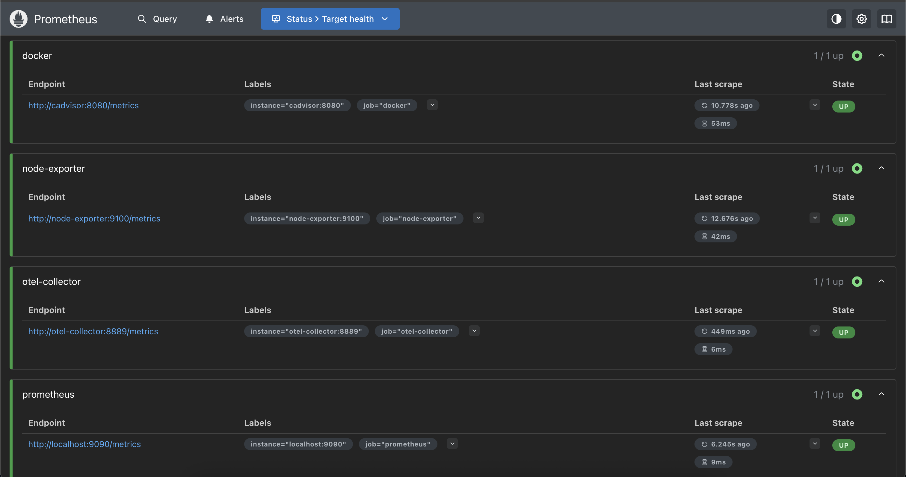

# All targets are healthy
- `up` 
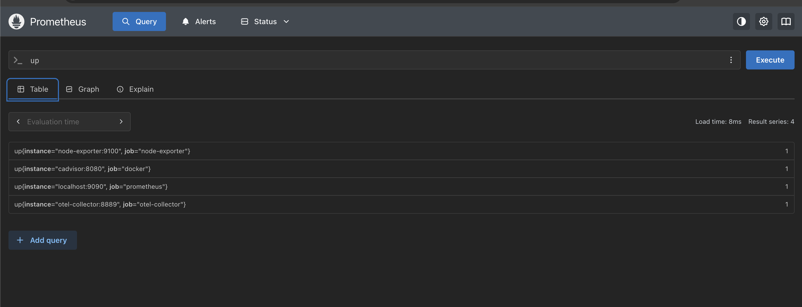

# Memory usage
- `(1 - node_memory_MemAvailable_bytes / node_memory_MemTotal_bytes) * 100`

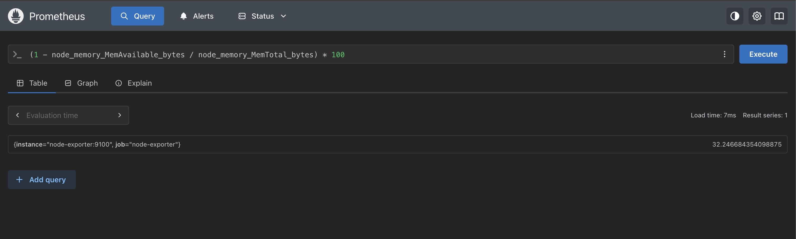

# Container CPU per container

- `rate(container_cpu_usage_seconds_total{id=~"/docker/[a-f0-9]{64}"}[5m]) * 100`

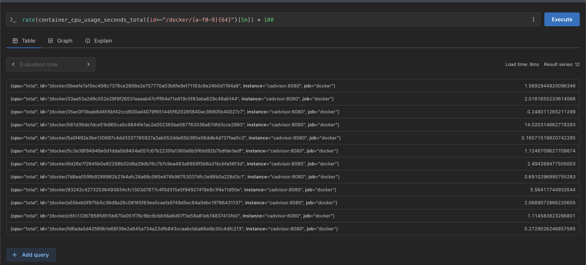

# Top 3 memory-hungry containers
- `topk(3, container_memory_usage_bytes{id=~"/docker/[a-f0-9]{64}"})`

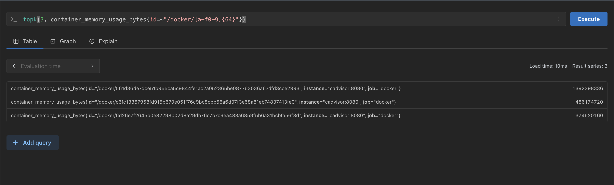

---

### Task 3: Validate the Logs Pipeline

1. 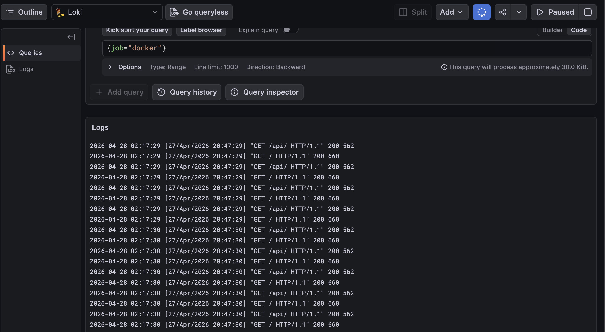
2. 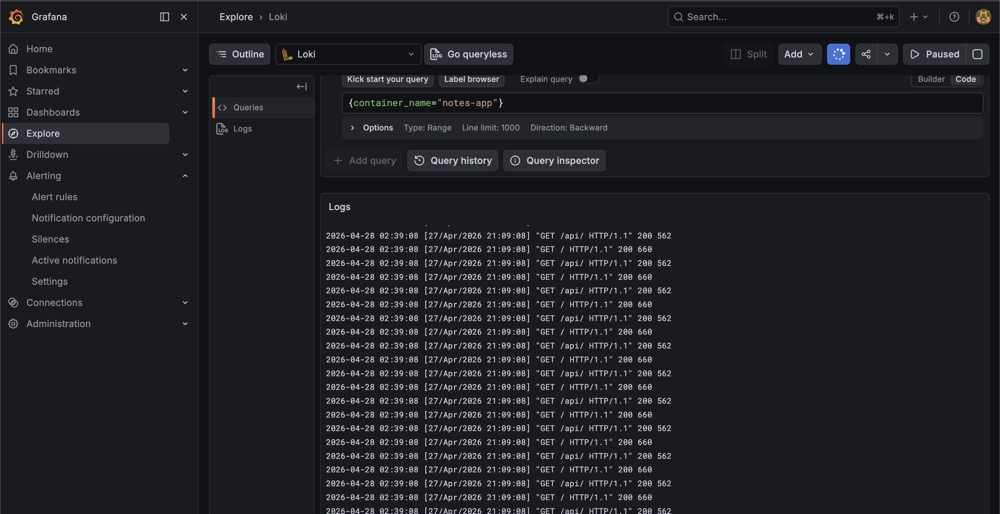
3. 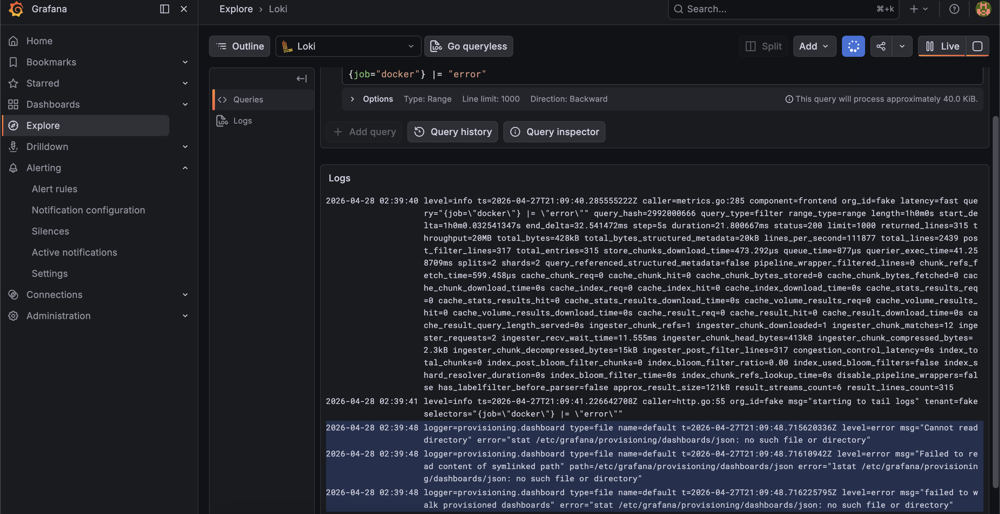
4. 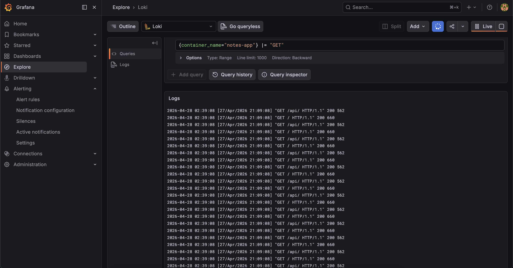


---
```
curl -X POST http://localhost:4318/v1/traces \
  -H "Content-Type: application/json" \
  -d '{"resourceSpans":[{"resource":{"attributes":[{"key":"service.name","value":{"stringValue":"notes-app"}}]},"scopeSpans":[{"spans":[{"traceId":"aaaabbbbccccdddd1111222233334444","spanId":"1111222233334444","name":"GET /api/notes","kind":2,"startTimeUnixNano":"1700000000000000000","endTimeUnixNano":"1700000000150000000","status":{"code":1}}]}]}]}'

```

`docker logs otel-collector 2>&1 | grep -A 3 "Traces"`

```
docker logs otel-collector 2>&1 | grep -A 3 "Traces"
2026-04-27T21:11:20.846Z        info    Traces  {"resource": {"service.instance.id": "735e13ec-d8be-4e39-9472-e60c5c3a6c36", "service.name": "otelcol-contrib", "service.version": "0.150.1"}, "otelcol.component.id": "debug", "otelcol.component.kind": "exporter", "otelcol.signal": "traces", "resource spans": 1, "spans": 2}
2026-04-27T21:14:58.265Z        info    Traces  {"resource": {"service.instance.id": "735e13ec-d8be-4e39-9472-e60c5c3a6c36", "service.name": "otelcol-contrib", "service.version": "0.150.1"}, "otelcol.component.id": "debug", "otelcol.component.kind": "exporter", "otelcol.signal": "traces", "resource spans": 1, "spans": 1}

```

---
### Task 5: Build a Unified "Production Overview" Dashboard

- 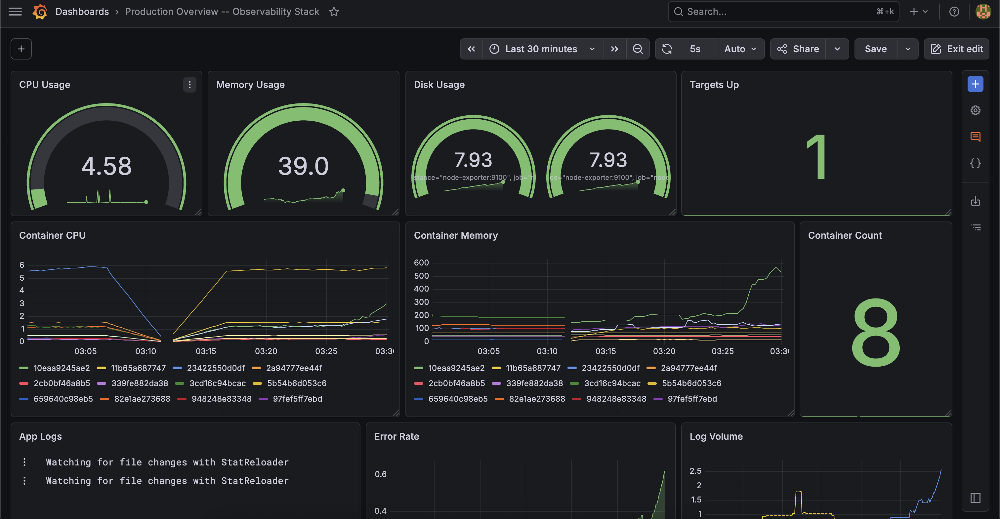
- 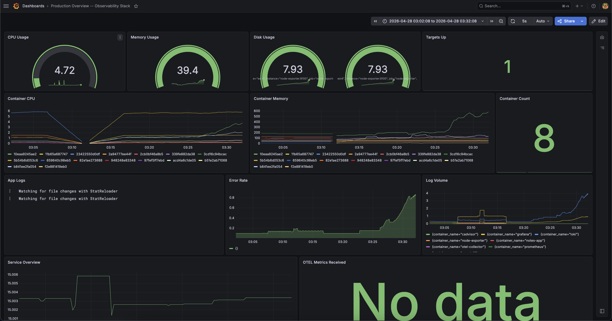

---
### Task 6: Compare Your Stack with the Reference and Document

| Component                   | Your Version                                      | Reference Repo                                               | Key Differences                                                                         |
| --------------------------- | ------------------------------------------------- | ------------------------------------------------------------ | --------------------------------------------------------------------------------------- |
| `prometheus.yml`            | Basic scrape configs (Prometheus + Node Exporter) | Includes Prometheus, Node Exporter, cAdvisor, OTEL Collector | Reference has **full observability coverage** with more scrape jobs and better labeling |
| `loki-config.yml`           | Minimal/local storage setup                       | Structured config with schema, index, and chunk storage      | Reference is **production-structured** (better indexing + retention ready)              |
| `promtail-config.yml`       | Basic log scraping (file paths)                   | Docker-based log scraping with container labels              | Reference supports **container-aware logging**                                          |
| `otel-collector-config.yml` | Basic OTLP receiver + debug exporter              | Full pipeline (receivers → processors → exporters)           | Reference is **pipeline-based + scalable design**                                       |
| `datasources.yml`           | Manually added in Grafana UI                      | Auto-provisioned (Prometheus + Loki)                         | Reference enables **infra-as-code for observability**                                   |
| `docker-compose.yml`        | Separate services added gradually                 | Fully integrated 8-service stack                             | Reference is **production-style orchestration with networking + restart policies**      |

| Day | What You Built                                                                |
| --- | ----------------------------------------------------------------------------- |
| 73  | Learned **Prometheus**, metrics, and basic PromQL queries                     |
| 74  | Added **Node Exporter + cAdvisor**, built Grafana dashboards                  |
| 75  | Implemented **Loki + Promtail**, explored LogQL and logs                      |
| 76  | Set up **OpenTelemetry Collector**, traces + alerting rules                   |
| 77  | Integrated everything into a **full observability stack + unified dashboard** |


```
🚀 What I Would Add for Production

To make this stack production-ready:

🔔 Alerting & Incident Response
Add Alertmanager for routing alerts to:
Slack
PagerDuty
Email
🔍 Distributed Tracing
Replace debug exporter with Grafana Tempo for persistent trace storage
🔐 Security
Enable HTTPS/TLS for all services
Add authentication (Grafana, Prometheus endpoints)
🗄️ Data Management
Configure log retention policies in Loki
Add storage limits to avoid disk exhaustion
⚖️ High Availability
Multiple Prometheus replicas (HA setup)
Loki in distributed mode
Load balancing across services
```

| Feature        | This Stack (Self-Hosted) | Datadog / New Relic / CloudWatch |
| -------------- | ------------------------ | -------------------------------- |
| Cost           | Free (infra cost only)   | Expensive at scale               |
| Setup          | Complex (manual setup)   | Very easy (plug-and-play)        |
| Flexibility    | Full control             | Limited customization            |
| Maintenance    | You manage everything    | Fully managed                    |
| Vendor Lock-in | None                     | High                             |
| Scalability    | Needs manual scaling     | Auto-scaled                      |


```
💡 Final Takeaways
Observability = Metrics + Logs + Traces together
Grafana becomes the single pane of glass
Prometheus = brain (metrics)
Loki = logs
OTEL = traces pipeline
cAdvisor + Node Exporter = visibility into infra

👉 The biggest shift:

From “my app is running” → “I know exactly what it’s doing and why”
```