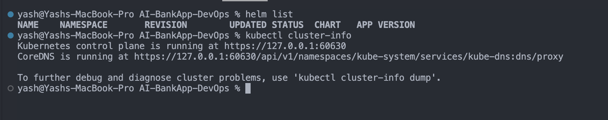
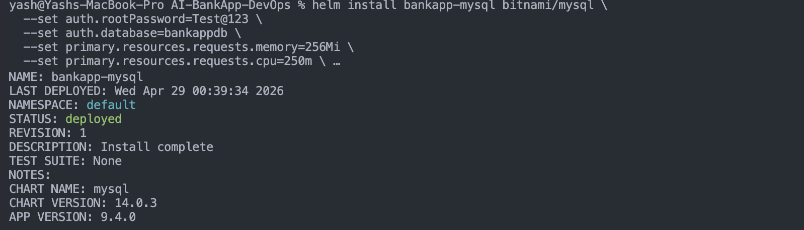
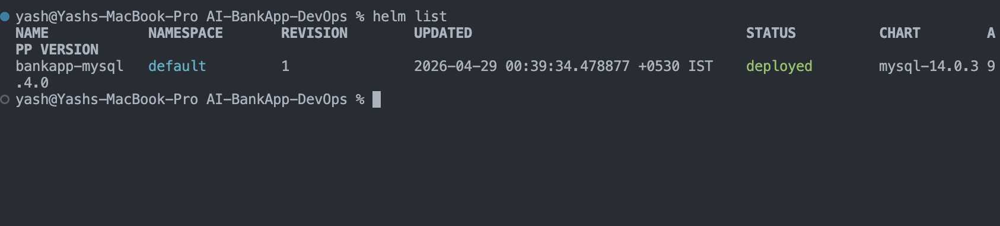
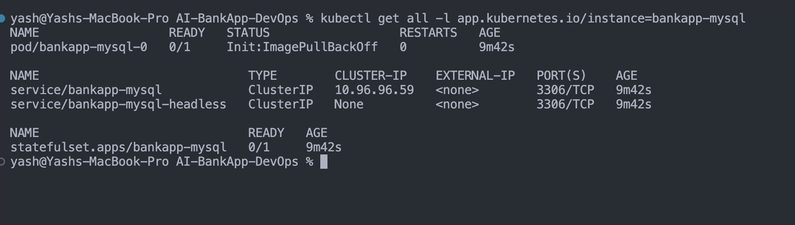
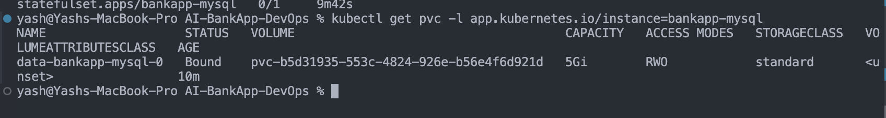
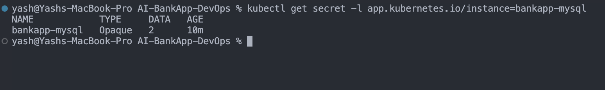
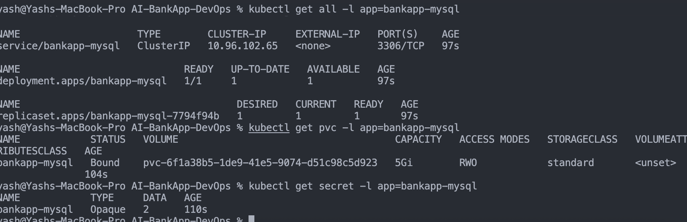
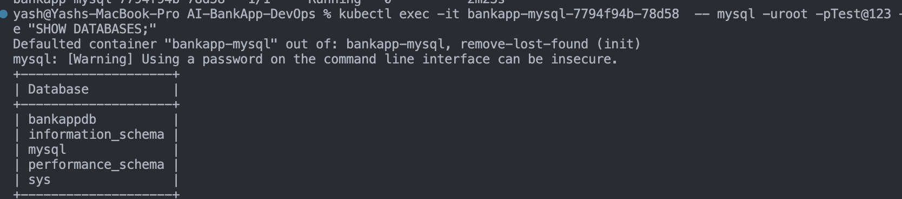
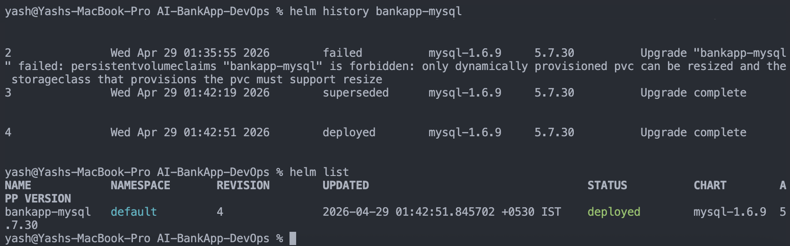
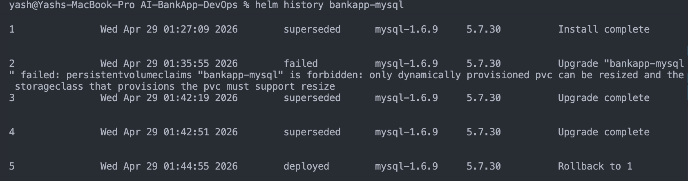

## Challenge Tasks

### Task 1: Understand Helm Concepts

Alright, think of Helm in **very practical DevOps terms**, not theory.

---

## 🚀 What is Helm (in simple words)?

Helm is basically:

👉 **“npm for Kubernetes”**
👉 or **“docker-compose but for K8s + reusable + production-ready”**

Instead of managing 10–15 YAML files manually, Helm lets you:

✔ Bundle everything into **one reusable package (chart)**
✔ Customize using **values (like env configs)**
✔ Install with **one command**

---

## 🧠 Why you even need Helm (your current pain)

Right now in your project:

You probably have:

* Deployment.yaml
* Service.yaml
* ConfigMap.yaml
* Secret.yaml
* maybe Ingress, HPA, etc.

👉 Problem:

* Changing image → edit YAML manually
* Dev vs Prod → duplicate files or edit configs
* Rollback → painful
* Reuse → copy-paste hell

---

## 📦 Helm solves this like this:

Instead of this mess 👇

```
k8s/
  deployment.yaml
  service.yaml
  configmap.yaml
  secret.yaml
```

You get this 👇

```
helm-chart/
  Chart.yaml
  values.yaml
  templates/
    deployment.yaml
    service.yaml
```

---

## 🔑 Core Concepts (super simplified)

### 1. Chart = Your App Package

👉 Think:
**Chart = your entire app infra bundled**

Includes:

* Deployment
* Service
* Configs
* Secrets

💡 Example:
Your Bank App = 1 chart

---

### 2. Release = Running Instance

👉 When you install a chart:

```
helm install bankapp .
```

You create a **release**

💡 You can do:

```
helm install bankapp-dev .
helm install bankapp-prod .
```

Same chart → multiple environments

---

### 3. Values = Config Control Center

This is the **most important part**

Instead of hardcoding:

```yaml
replicas: 2
image: bankapp:v1
```

You write:

```yaml
replicas: {{ .Values.replicas }}
image: {{ .Values.image }}
```

And control everything from:

```yaml
values.yaml
```

💡 Example:

```yaml
replicas: 3
image: bankapp:v2
```

👉 Change ONE file → whole app updates

---

### 4. Repository = Chart Store

Like:

* DockerHub → images
* Helm Repo → charts

Examples:

* MySQL chart
* Redis chart
* Prometheus chart

---

## 🔥 Real Example (Your Use Case)

Without Helm:
👉 Change image → edit deployment.yaml

With Helm:
👉 Just update:

```yaml
image: bankapp:v2
```

and run:

```
helm upgrade bankapp .
```

DONE.

---

## ⚡ Why Helm is powerful (real-world)

### 1. 🔁 One chart → multiple environments

```
values-dev.yaml
values-prod.yaml
```

Run:

```
helm install bankapp -f values-dev.yaml
helm install bankapp -f values-prod.yaml
```

---

### 2. ⏪ Easy rollback

```
helm rollback bankapp 1
```

No YAML debugging. Instant revert.

---

### 3. 🔗 Dependencies

Your app needs:

* MySQL
* Redis

👉 Helm can install all together.

---

### 4. 📦 Reusability

You don’t rewrite YAML again and again.

---

## 🧩 One-line mental model

👉 **Helm = Templates + Config + Versioning for Kubernetes**

---

## 💡 Simple analogy (best way to remember)

| Concept | Real World Example                         |
| ------- | ------------------------------------------ |
| Chart   | Swiggy restaurant menu                     |
| Values  | Customize order (less spicy, extra cheese) |
| Release | Your actual order                          |
| Repo    | Swiggy app                                 |

---

## 🧠 What matters for Day 78 (focus)

You don’t need deep theory.

Just understand:

✔ Helm removes YAML duplication
✔ Values control everything
✔ Chart = package
✔ Release = deployed app

---

### Task 2: Install Helm and Explore the AI-BankApp

- 

---

### Task 3: Deploy MySQL Using a Helm Chart

1. `helm repo add bitnami `
2. `helm repo update`
3. `helm repo search bitnami/mysql`

```bash
helm install bankapp-mysql bitnami/mysql \
  --set auth.rootPassword=Test@123 \
  --set auth.database=bankappdb \
  --set primary.resources.requests.memory=256Mi \
  --set primary.resources.requests.cpu=250m \
  --set primary.resources.limits.memory=512Mi \
  --set primary.resources.limits.cpu=500m \
  --set primary.persistence.size=5Gi
```



- `helm list`


- `kubectl get all -l app.kubernetes.io/instance=bankapp-mysql`


- `kubectl get pvc -l app.kubernetes.io/instance=bankapp-mysql`


- `kubectl get secret -l app.kubernetes.io/instance=bankapp-mysql`


---

## Bitnami is no more free use this ----

1. helm repo add stable https://charts.helm.sh/stable
2. helm repo update
3. helm search repo stable/mysql


```
helm install bankapp-mysql stable/mysql \
  --set imageTag=8.0 \
  --set mysqlRootPassword=Test@123 \
  --set mysqlDatabase=bankappdb \
  --set persistence.size=5Gi \
  --set resources.requests.memory=256Mi \
  --set resources.requests.cpu=250m \
  --set resources.limits.memory=512Mi \
  --set resources.limits.cpu=500m
```

```
kubectl get all -l app=bankapp-mysql
kubectl get pvc -l app=bankapp-mysql
kubectl get secret -l app=bankapp-mysql
```

- 
`kubectl exec -it bankapp-mysql-7794f94b-78d58  -- mysql -uroot -pTest@123 -e "SHOW DATABASES;"`
- 

---

### Task 4: Customize a Deployment with Values Files

- `helm show values stable/mysql | head -80`
```
## mysql image version
## ref: https://hub.docker.com/r/library/mysql/tags/
##
image: "mysql"
imageTag: "5.7.30"

strategy:
  type: Recreate

busybox:
  image: "busybox"
  tag: "1.32"

testFramework:
  enabled: true
  image: "bats/bats"
  tag: "1.2.1"
  imagePullPolicy: IfNotPresent
  securityContext: {}

## Specify password for root user
##
## Default: random 10 character string
# mysqlRootPassword: testing

## Create a database user
##
# mysqlUser:
## Default: random 10 character string
# mysqlPassword:

## Allow unauthenticated access, uncomment to enable
##
# mysqlAllowEmptyPassword: true

## Create a database
##
# mysqlDatabase:

## Specify an imagePullPolicy (Required)
## It's recommended to change this to 'Always' if the image tag is 'latest'
## ref: http://kubernetes.io/docs/user-guide/images/#updating-images
##
imagePullPolicy: IfNotPresent

## Additionnal arguments that are passed to the MySQL container.
## For example use --default-authentication-plugin=mysql_native_password if older clients need to
## connect to a MySQL 8 instance.
args: []

extraVolumes: |
  # - name: extras
  #   emptyDir: {}

extraVolumeMounts: |
  # - name: extras
  #   mountPath: /usr/share/extras
  #   readOnly: true

extraInitContainers: |
  # - name: do-something
  #   image: busybox
  #   command: ['do', 'something']

## A string to add extra environment variables
# extraEnvVars: |
#   - name: EXTRA_VAR
#     value: "extra"

# Optionally specify an array of imagePullSecrets.
# Secrets must be manually created in the namespace.
# ref: https://kubernetes.io/docs/concepts/containers/images/#specifying-imagepullsecrets-on-a-pod
# imagePullSecrets:
  # - name: myRegistryKeySecretName

## Node selector
## ref: https://kubernetes.io/docs/concepts/configuration/assign-pod-node/#nodeselector
nodeSelector: {}

## Affinity

```
---

### Task 5: Manage Releases -- Upgrade, Rollback, Uninstall

- `helm history bankapp-mysql`


```
helm rollback bankapp-mysql 1
Rollback was a success! Happy Helming!
```

- `helm history bankapp-mysql`



### Task 6: Explore a Chart's Structure

```bash
helm pull bitnami/mysql --untar
ls mysql/
```

- Clean up:
```bash
helm uninstall bankapp-mysql
rm -rf mysql/
```

---