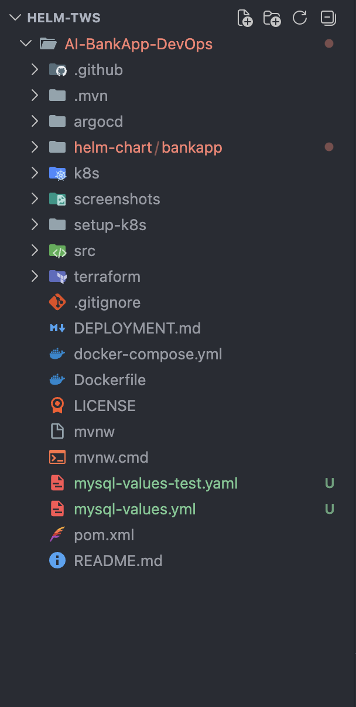
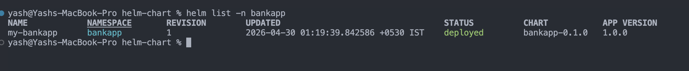
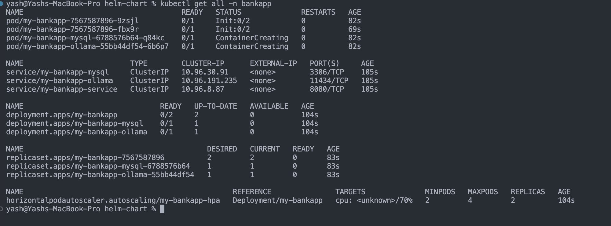
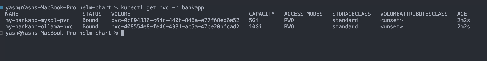
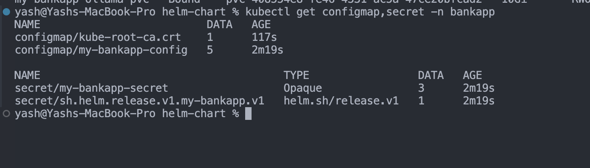
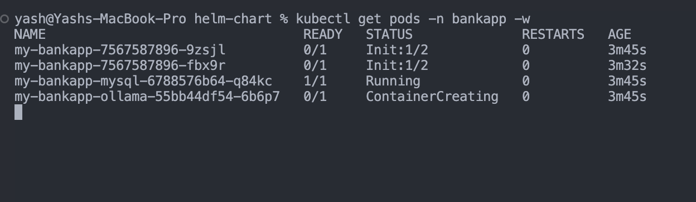
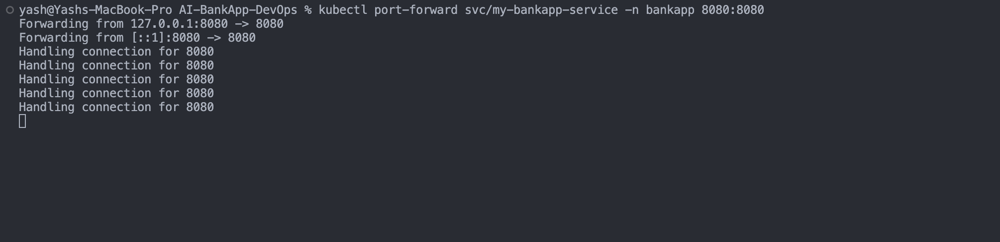
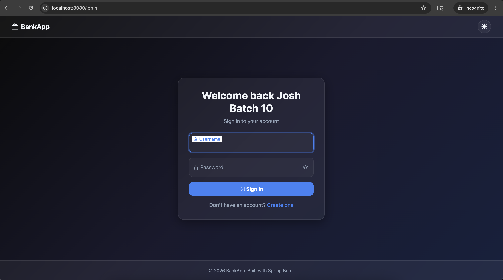

## Challenge Tasks

### Task 1: Scaffold the Chart and Study the Raw Manifests

- Done 


---

### Task 2: Define Chart.yaml and values.yaml


This line is basically pointing out a **huge DevOps best practice improvement**. Let’s break it down clearly.

---

# 🔴 Before (Raw Kubernetes YAML)

In your original `k8s/secrets.yml`, you probably had something like:

```yaml
data:
  MYSQL_PASSWORD: VGVzdEAxMjM=
```

👉 That value is:

* **base64 encoded manually**
* **hardcoded inside YAML**

---

## ❌ Problems with this approach

### 1. Hard to manage

If you want to change password:

* You must **edit YAML**
* Re-encode manually (`echo -n "password" | base64`)

---

### 2. Not reusable

If you deploy:

* Dev → needs one password
* Staging → different password
* Prod → secure password

👉 You need **3 different YAML files** 😵

---

### 3. Risky

* Credentials live inside repo
* Easy to accidentally leak

---

# 🟢 After (Helm Way)

Now in Helm:

### values.yaml

```yaml
secrets:
  mysqlPassword: Test@123
```

---

### Template (`secrets.yaml`)

```yaml
data:
  MYSQL_PASSWORD: {{ .Values.secrets.mysqlPassword | b64enc | quote }}
```

---

## ✅ What changed?

### 1. No manual base64

Helm does it automatically:

```yaml
| b64enc
```

👉 You just write:

```
Test@123
```

👉 Helm converts it to:

```
VGVzdEAxMjM=
```

---

### 2. Dynamic configuration

Now you can override **without touching YAML**

```bash
helm install app ./chart \
  --set secrets.mysqlPassword=Prod@Secure123
```

---

### 3. One chart → multiple environments

| Environment | Password        |
| ----------- | --------------- |
| Dev         | Test@123        |
| Staging     | Staging@123     |
| Prod        | UltraSecure@987 |

👉 Same chart, different values

---

### 4. Cleaner + safer workflow

You can:

* Store values in separate files:

  ```
  values-dev.yaml
  values-prod.yaml
  ```
* Or use secret managers later (Vault, AWS Secrets Manager)

---

# 🔁 Side-by-side comparison

| Feature         | Raw YAML       | Helm                 |
| --------------- | -------------- | -------------------- |
| Base64 encoding | Manual         | Automatic (`b64enc`) |
| Change values   | Edit file      | CLI / values.yaml    |
| Reusability     | ❌ Low          | ✅ High               |
| Environments    | Multiple files | One chart            |
| Maintainability | ❌ Painful      | ✅ Easy               |

---

# 🧠 One-line understanding

👉 **Raw YAML = static config**
👉 **Helm = dynamic + reusable config**

---

# ⚡ Real DevOps Insight

This is why Helm exists.

Without Helm:

```
12 YAML files × 3 environments = 36 files 😵
```

With Helm:

```
1 chart + 3 values files = clean setup ✅
```

---

### Task 3: Write the Core Templates

- Done

### Task 4: Write the Deployment Templates

- Done

### Task 5: Write the Services and HPA Templates

- `helm template my-bankapp bankapp/`

```
# Source: bankapp/templates/secrets.yaml
apiVersion: v1
kind: Secret
metadata:
  name: my-bankapp-secret
  namespace: default
  labels:
    helm.sh/chart: bankapp-0.1.0
    app.kubernetes.io/name: bankapp
    app.kubernetes.io/instance: my-bankapp
    app.kubernetes.io/version: "1.0.0"
    app.kubernetes.io/managed-by: Helm
type: Opaque
data:
  MYSQL_ROOT_PASSWORD: "VGVzdEAxMjM="
  MYSQL_USER: "cm9vdA=="
  MYSQL_PASSWORD: "VGVzdEAxMjM="
---
# Source: bankapp/templates/configmap.yaml
apiVersion: v1
kind: ConfigMap
metadata:
  name: my-bankapp-config
  namespace: default
  labels:
    helm.sh/chart: bankapp-0.1.0
    app.kubernetes.io/name: bankapp
    app.kubernetes.io/instance: my-bankapp
    app.kubernetes.io/version: "1.0.0"
    app.kubernetes.io/managed-by: Helm
data:
  MYSQL_HOST: my-bankapp-mysql
  MYSQL_PORT: "3306"
  MYSQL_DATABASE: "bankappdb"
  OLLAMA_URL: "http://my-bankapp-ollama:11434"
  SERVER_FORWARD_HEADERS_STRATEGY: "native"
---
# Source: bankapp/templates/storage.yaml
apiVersion: storage.k8s.io/v1
kind: StorageClass
metadata:
  name: gp3
provisioner: ebs.csi.aws.com
parameters:
  type: gp3
  fsType: ext4
reclaimPolicy: Delete
volumeBindingMode: WaitForFirstConsumer
allowVolumeExpansion: true
---
# Source: bankapp/templates/storage.yaml
apiVersion: v1
kind: PersistentVolumeClaim
metadata:
  name: my-bankapp-mysql-pvc
  namespace: default
  labels:
    helm.sh/chart: bankapp-0.1.0
    app.kubernetes.io/name: bankapp
    app.kubernetes.io/instance: my-bankapp
    app.kubernetes.io/version: "1.0.0"
    app.kubernetes.io/managed-by: Helm
spec:
  storageClassName: gp3
  accessModes:
    - ReadWriteOnce
  resources:
    requests:
      storage: 5Gi
---
# Source: bankapp/templates/storage.yaml
apiVersion: v1
kind: PersistentVolumeClaim
metadata:
  name: my-bankapp-ollama-pvc
  namespace: default
  labels:
    helm.sh/chart: bankapp-0.1.0
    app.kubernetes.io/name: bankapp
    app.kubernetes.io/instance: my-bankapp
    app.kubernetes.io/version: "1.0.0"
    app.kubernetes.io/managed-by: Helm
spec:
  storageClassName: gp3
  accessModes:
    - ReadWriteOnce
  resources:
    requests:
      storage: 10Gi
---
# Source: bankapp/templates/services.yaml
apiVersion: v1
kind: Service
metadata:
  name: my-bankapp-mysql
  namespace: default
spec:
  selector:
    app: my-bankapp-mysql
  ports:
    - port: 3306
---
# Source: bankapp/templates/services.yaml
apiVersion: v1
kind: Service
metadata:
  name: my-bankapp-ollama
  namespace: default
spec:
  selector:
    app: my-bankapp-ollama
  ports:
    - port: 11434
---
# Source: bankapp/templates/services.yaml
apiVersion: v1
kind: Service
metadata:
  name: my-bankapp-service
  namespace: default
spec:
  type: ClusterIP
  sessionAffinity: ClientIP
  sessionAffinityConfig:
    clientIP:
      timeoutSeconds: 3600
  selector:
    app: my-bankapp
  ports:
    - port: 8080
      targetPort: 8080
---
# Source: bankapp/templates/bankapp-deployment.yaml
apiVersion: apps/v1
kind: Deployment
metadata:
  name: my-bankapp
  namespace: default
  labels:
    helm.sh/chart: bankapp-0.1.0
    app.kubernetes.io/name: bankapp
    app.kubernetes.io/instance: my-bankapp
    app.kubernetes.io/version: "1.0.0"
    app.kubernetes.io/managed-by: Helm
spec:
  selector:
    matchLabels:
      app: my-bankapp
  template:
    metadata:
      labels:
        app: my-bankapp
    spec:
      initContainers:
        - name: wait-for-mysql
          image: busybox:1.36
          command: ["/bin/sh", "-c", "until nc -z my-bankapp-mysql 3306; do sleep 2; done"]
          resources:
            requests: { memory: "32Mi", cpu: "50m" }
            limits: { memory: "64Mi", cpu: "100m" }
        - name: wait-for-ollama
          image: busybox:1.36
          command: ["/bin/sh", "-c", "until nc -z my-bankapp-ollama 11434; do sleep 2; done"]
          resources:
            requests: { memory: "32Mi", cpu: "50m" }
            limits: { memory: "64Mi", cpu: "100m" }
      containers:
        - name: bankapp
          image: "trainwithshubham/ai-bankapp-eks:latest"
          imagePullPolicy: Always
          ports:
            - containerPort: 8080
          envFrom:
            - configMapRef:
                name: my-bankapp-config
            - secretRef:
                name: my-bankapp-secret
          resources:
            limits:
              cpu: 500m
              memory: 512Mi
            requests:
              cpu: 250m
              memory: 256Mi
          readinessProbe:
            httpGet:
              path: /actuator/health
              port: 8080
            initialDelaySeconds: 30
            failureThreshold: 15
          livenessProbe:
            httpGet:
              path: /actuator/health
              port: 8080
            initialDelaySeconds: 60
            periodSeconds: 10
            failureThreshold: 5
---
# Source: bankapp/templates/mysql-deployment.yaml
apiVersion: apps/v1
kind: Deployment
metadata:
  name: my-bankapp-mysql
  namespace: default
  labels:
    helm.sh/chart: bankapp-0.1.0
    app.kubernetes.io/name: bankapp
    app.kubernetes.io/instance: my-bankapp
    app.kubernetes.io/version: "1.0.0"
    app.kubernetes.io/managed-by: Helm
spec:
  selector:
    matchLabels:
      app: my-bankapp-mysql
  strategy:
    type: Recreate
  template:
    metadata:
      labels:
        app: my-bankapp-mysql
    spec:
      containers:
        - name: mysql
          image: "mysql:8.0"
          ports:
            - containerPort: 3306
          env:
            - name: MYSQL_ROOT_PASSWORD
              valueFrom:
                secretKeyRef:
                  name: my-bankapp-secret
                  key: MYSQL_ROOT_PASSWORD
            - name: MYSQL_DATABASE
              valueFrom:
                configMapKeyRef:
                  name: my-bankapp-config
                  key: MYSQL_DATABASE
          resources:
            limits:
              cpu: 500m
              memory: 512Mi
            requests:
              cpu: 250m
              memory: 256Mi
          volumeMounts:
            - name: mysql-storage
              mountPath: /var/lib/mysql
          readinessProbe:
            exec:
              command: ["mysqladmin", "ping", "-h", "localhost"]
            initialDelaySeconds: 15
            failureThreshold: 10
          livenessProbe:
            exec:
              command: ["mysqladmin", "ping", "-h", "localhost"]
            initialDelaySeconds: 30
            periodSeconds: 10
            failureThreshold: 5
      volumes:
        - name: mysql-storage
          persistentVolumeClaim:
            claimName: my-bankapp-mysql-pvc
---
# Source: bankapp/templates/ollama-deployment.yaml
apiVersion: apps/v1
kind: Deployment
metadata:
  name: my-bankapp-ollama
  namespace: default
  labels:
    helm.sh/chart: bankapp-0.1.0
    app.kubernetes.io/name: bankapp
    app.kubernetes.io/instance: my-bankapp
    app.kubernetes.io/version: "1.0.0"
    app.kubernetes.io/managed-by: Helm
spec:
  selector:
    matchLabels:
      app: my-bankapp-ollama
  strategy:
    type: Recreate
  template:
    metadata:
      labels:
        app: my-bankapp-ollama
    spec:
      containers:
        - name: ollama
          image: "ollama/ollama:latest"
          ports:
            - containerPort: 11434
          resources:
            limits:
              cpu: 1500m
              memory: 2.5Gi
            requests:
              cpu: 900m
              memory: 2Gi
          volumeMounts:
            - name: ollama-storage
              mountPath: /root/.ollama
          lifecycle:
            postStart:
              exec:
                command:
                  - /bin/sh
                  - -c
                  - |
                    until ollama list > /dev/null 2>&1; do sleep 2; done
                    ollama pull tinyllama
          readinessProbe:
            exec:
              command: ["/bin/sh", "-c", "ollama list | grep -q tinyllama"]
            initialDelaySeconds: 30
            failureThreshold: 30
          livenessProbe:
            httpGet:
              path: /
              port: 11434
            initialDelaySeconds: 60
            periodSeconds: 10
            failureThreshold: 5
      volumes:
        - name: ollama-storage
          persistentVolumeClaim:
            claimName: my-bankapp-ollama-pvc
---
# Source: bankapp/templates/hpa.yaml
apiVersion: autoscaling/v2
kind: HorizontalPodAutoscaler
metadata:
  name: my-bankapp-hpa
  namespace: default
  labels:
    helm.sh/chart: bankapp-0.1.0
    app.kubernetes.io/name: bankapp
    app.kubernetes.io/instance: my-bankapp
    app.kubernetes.io/version: "1.0.0"
    app.kubernetes.io/managed-by: Helm
spec:
  scaleTargetRef:
    apiVersion: apps/v1
    kind: Deployment
    name: my-bankapp
  minReplicas: 2
  maxReplicas: 4
  metrics:
    - type: Resource
      resource:
        name: cpu
        target:
          type: Utilization
          averageUtilization: 70
  behavior:
    scaleUp:
      stabilizationWindowSeconds: 30
      policies:
        - type: Pods
          value: 2
          periodSeconds: 60
    scaleDown:
      stabilizationWindowSeconds: 300
      policies:
        - type: Pods
          value: 1
          periodSeconds: 60
```

---

```
helm install my-bankapp bankapp/ \
  -n bankapp --create-namespace \
  --set storageClass.create=false \
  --set mysql.persistence.storageClass=standard \
  --set ollama.persistence.storageClass=standard
```

```
NAME: my-bankapp
LAST DEPLOYED: Thu Apr 30 01:19:39 2026
NAMESPACE: bankapp
STATUS: deployed
REVISION: 1
DESCRIPTION: Install complete
TEST SUITE: None
NOTES:
AI-BankApp has been deployed successfully!

Release: my-bankapp
Namespace: bankapp

Components:
  - BankApp (Spring Boot): enabled
  - MySQL:  enabled
  - Ollama: enabled

To access the application, run:
  kubectl port-forward svc/my-bankapp-service \
    -n bankapp 8080:8080

Then visit: http://localhost:8080

NOTE: Ollama may take several minutes to pull the 'tinyllama' model.
Watch pod status with:
  kubectl get pods -n bankapp -w
```

- 
- 
- 
- 

`kubectl get pods -n bankapp -w`
- 

```
kubectl port-forward svc/my-bankapp-bankapp-service -n bankapp 8080:8080
```




