## Challenge Tasks

### Task 1: Understand EKS Architecture


```
# Understanding Amazon EKS from Beginner POV

Before EKS, you were using Kubernetes locally with Kind.

That means:

* Everything was running on your own laptop
* Kubernetes control plane + worker nodes existed inside Docker containers
* Good for learning
* Not good for production apps

Now you are moving to Amazon EKS, which is real cloud Kubernetes used in production.

---

# First Understand Kubernetes Architecture

Kubernetes mainly has 2 big parts:

## 1. Control Plane (Brain of Kubernetes)

This is the management layer.

It handles:

* API requests
* Scheduling pods
* Cluster state
* Health monitoring
* Scaling decisions

Main components inside control plane:

| Component          | Purpose                        |
| ------------------ | ------------------------------ |
| API Server         | Entry point to Kubernetes      |
| etcd               | Database storing cluster state |
| Scheduler          | Decides where pods run         |
| Controller Manager | Keeps desired state maintained |

Think of it as:

> "The management office"

---

## 2. Worker Nodes / Data Plane

These are the actual machines running your applications.

They run:

* Pods
* Containers
* Application workloads

Think of it as:

> "The workers doing actual tasks"

---

# What is “Managed Kubernetes”?

Without EKS:
You would need to manually:

* Install Kubernetes
* Configure etcd
* Secure API server
* Handle HA (High Availability)
* Upgrade clusters
* Patch vulnerabilities
* Recover failures

This is extremely difficult in production.

---

# What EKS Does

Amazon EKS manages the HARD part for you.

AWS manages:

* API server
* etcd
* Scheduler
* Controller manager
* HA setup
* Control plane patching
* Control plane upgrades

You manage:

* Worker nodes
* Applications
* Pods
* Storage
* Networking configs
* Deployments

---

# Real Life Analogy

Imagine opening a restaurant.

Without EKS:
You build:

* Building
* Electricity
* Kitchen
* Security
* Plumbing
* Water systems

With EKS:
AWS already gives:

* Fully managed building
* Infrastructure
* Security systems

You only focus on:

* Cooking food (your app)

---

# EKS Architecture

Here’s the high-level architecture:

```text
                    AWS Cloud
-------------------------------------------------

            EKS Control Plane (Managed by AWS)
          --------------------------------------
          | API Server                        |
          | etcd                              |
          | Scheduler                         |
          | Controller Manager                |
          --------------------------------------

                      |
                      |
                kubectl/API

                      |
-------------------------------------------------
                Your AWS VPC
-------------------------------------------------

     Worker Node Group (EC2 Instances)

     Node 1 ----------------------------
     | Pod: frontend                  |
     | Pod: backend                   |
     ----------------------------------

     Node 2 ----------------------------
     | Pod: mysql                     |
     | Pod: ollama                    |
     ----------------------------------

```

---

# What is a VPC?

VPC = Virtual Private Cloud

Think of it as:

> Your own private network inside AWS

Your EKS cluster runs inside a VPC.

The VPC contains:

* Subnets
* IP ranges
* Route tables
* Internet gateways

---

# Why Multiple Availability Zones?

AWS spreads nodes across multiple AZs.

Example:

* ap-south-1a
* ap-south-1b
* ap-south-1c

Why?

If one data center fails:

* Your cluster still works

This gives:

* High availability
* Fault tolerance

---

# EKS Components

# 1. EKS Control Plane

Managed completely by AWS.

Runs in AWS-owned infrastructure.

You do NOT directly see:

* EC2 instances for control plane
* etcd machines

AWS hides them.

You only interact through:

* kubectl
* API endpoint

---

# 2. Node Groups

These are EC2 instances running your workloads.

Example:

```text
EC2 Instance
   └── kubelet
         └── Pods
```

---

# Types of Node Groups

## A. Managed Node Groups

Most common.

AWS manages:

* Provisioning
* Scaling
* Updates
* Node replacement

You simply define:

```hcl
desired_size = 2
instance_types = ["t3.medium"]
```

AWS handles the rest.

This is what most modern projects use.

---

## B. Self-Managed Nodes

You manage EC2 yourself.

You handle:

* AMIs
* Security patches
* Scaling
* Bootstrap scripts

More control.
More complexity.

Usually avoided unless necessary.

---

## C. Fargate Profiles

No servers at all.

AWS runs pods serverlessly.

You don't manage:

* EC2
* Nodes
* Scaling infrastructure

Good for:

* Small workloads
* Event-driven apps

Less control compared to EC2 nodes.

---

# IAM Integration in EKS

This is VERY important.

Kubernetes normally has its own RBAC system.

But EKS integrates with AWS IAM.

Meaning:

* AWS users/roles can access cluster
* Pods can get AWS permissions securely

---

# What is IRSA?

IRSA = IAM Roles for Service Accounts

This allows:

```text
Pod → IAM Role → AWS Service
```

Example:

* Pod uploads file to S3
* Pod reads secrets from Secrets Manager
* Pod uses DynamoDB

WITHOUT storing AWS keys inside containers.

Very secure.

---

# Now Let’s Understand the AI-BankApp Add-ons

Inside `terraform/eks.tf`,
Terraform installs several EKS add-ons.

These are extremely important.

---

# 1. CoreDNS

```text
Service Discovery + DNS
```

Inside Kubernetes:
Pods communicate using names.

Example:

```text
backend-service.default.svc.cluster.local
```

CoreDNS converts:

```text
backend-service
```

into:

```text
10.x.x.x
```

Without CoreDNS:
Pods cannot find each other.

---

# 2. kube-proxy

Handles networking between services and pods.

Example:

```text
Frontend Service
     ↓
Routes traffic
     ↓
Backend Pod
```

It manages:

* iptables rules
* Service routing
* Cluster networking

---

# 3. VPC CNI Plugin

One of the most important AWS-specific components.

Normal Kubernetes:
Pods get internal cluster IPs.

EKS:
Pods get REAL VPC IPs.

Meaning:

* Pods become first-class citizens inside VPC
* Better AWS networking integration

The VPC CNI plugin handles this.

---

# 4. EKS Pod Identity Agent

Used for IAM integration.

Allows:

```text
Pod → Assume IAM Role
```

Securely.

Without:

* hardcoded AWS credentials

This is modern AWS best practice.

---

# 5. AWS EBS CSI Driver

CSI = Container Storage Interface

This enables Kubernetes to attach EBS volumes to pods.

Example:

```text
MySQL Pod
   ↓
Persistent EBS Volume
```

Without this:
Data disappears when pod restarts.

Critical for:

* MySQL
* Databases
* Ollama model storage

---

# Why This Matters

Containers are ephemeral.

If pod dies:

* container filesystem disappears

Persistent volumes solve this.

EBS provides:

* durable storage
* persistent database data

---

# 6. Metrics Server

Enables:

```bash
kubectl top pods
kubectl top nodes
```

Provides:

* CPU usage
* Memory usage

Also required for:

* Horizontal Pod Autoscaler (HPA)

Example:

```text
High CPU
   ↓
Kubernetes auto-scales pods
```

---

# Why Terraform is Used

Instead of manually creating:

* VPC
* Subnets
* IAM roles
* EKS cluster
* Node groups

Terraform automates everything.

Infrastructure becomes:

```text
Infrastructure as Code
```

Benefits:

* Repeatable
* Version controlled
* Easy to recreate
* Production ready

---

# What Happens When You Run Terraform

```bash
terraform init
terraform plan
terraform apply
```

Terraform will:

1. Create VPC
2. Create subnets
3. Create IAM roles
4. Create EKS cluster
5. Create node groups
6. Install EKS add-ons
7. Configure networking

After completion:
You get a real Kubernetes cluster in AWS.

---

# How kubectl Connects to EKS

This command updates your kubeconfig:

```bash
aws eks update-kubeconfig \
  --region ap-south-1 \
  --name ai-bankapp-cluster
```

Now kubectl can talk to EKS.

Test:

```bash
kubectl get nodes
```

You’ll see EC2 worker nodes.

---

# Final Big Picture

```text
Terraform
   ↓
Creates AWS Infrastructure
   ↓
EKS Cluster
   ↓
Managed Kubernetes Control Plane
   ↓
EC2 Worker Nodes
   ↓
Pods Running AI-BankApp
   ↓
Persistent Storage via EBS
   ↓
IAM-integrated secure workloads
```

---

# Beginner Summary

| Concept            | Simple Meaning                 |
| ------------------ | ------------------------------ |
| EKS                | Managed Kubernetes by AWS      |
| Control Plane      | Kubernetes brain               |
| Worker Nodes       | Machines running apps          |
| Managed Kubernetes | AWS manages cluster brain      |
| Node Group         | Collection of EC2 worker nodes |
| VPC                | Private AWS network            |
| CoreDNS            | Pod name resolution            |
| kube-proxy         | Service networking             |
| VPC CNI            | Gives pods VPC IPs             |
| IRSA               | Pods securely use AWS IAM      |
| EBS CSI Driver     | Persistent storage for pods    |
| Metrics Server     | CPU/memory metrics             |
| Terraform          | Infrastructure automation      |


---


### Task 2: Study the AI-BankApp Terraform Configuration

```
                           AWS CLOUD
================================================================================

                               VPC (10.0.0.0/16)
--------------------------------------------------------------------------------

        PUBLIC SUBNETS                    PRIVATE SUBNETS
    (Internet Facing)                  (Worker Nodes Here)

    10.0.1.0/24                        10.0.4.0/24
    10.0.2.0/24                        10.0.5.0/24
    10.0.3.0/24                        10.0.6.0/24

          │                                     │
          │                                     │
    Load Balancers                       EKS Worker Nodes
                                                │
                                        ┌──────────────┐
                                        │ Node Group   │
                                        │ 3x t3.medium │
                                        └──────────────┘
                                                │
                                ┌──────────────────────────┐
                                │ Pods                     │
                                │ frontend                 │
                                │ backend                  │
                                │ mysql                    │
                                │ ollama                   │
                                └──────────────────────────┘

--------------------------------------------------------------------------------

                    INTRA SUBNETS (Control Plane Networking)

                    10.0.7.0/24
                    10.0.8.0/24
                    10.0.9.0/24

--------------------------------------------------------------------------------

                         EKS CONTROL PLANE (AWS Managed)

                     API Server
                     Scheduler
                     etcd
                     Controller Manager

================================================================================
```

Flow of Entire infra

```
Terraform Code
      ↓
Creates AWS Infrastructure
      ↓
Creates VPC + Subnets
      ↓
Creates EKS Cluster
      ↓
Creates Worker Nodes
      ↓
Installs EKS Add-ons
      ↓
Installs ArgoCD
      ↓
Cluster Ready for Deployments
```

| File             | Purpose                     |
| ---------------- | --------------------------- |
| variables.tf     | Defines input variables     |
| terraform.tfvars | Actual variable values      |
| vpc.tf           | Creates networking          |
| eks.tf           | Creates EKS cluster         |
| argocd.tf        | Installs ArgoCD             |
| outputs.tf       | Helper commands             |
| provider.tf      | AWS + Helm connection setup |

---

### Task 3: Provision the EKS Cluster

- 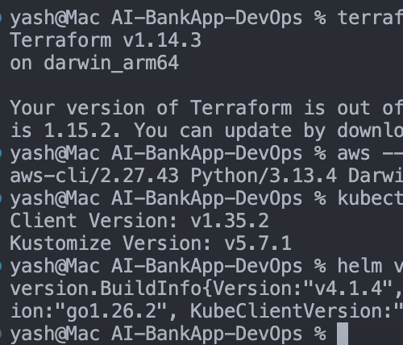

```bash
terraform --version    # >= 1.0 ✅
aws --version          # AWS CLI v2 ✅
kubectl version --client # ✅
helm version #✅
```

`aws sts get-caller-identity` - Verified ✅

- 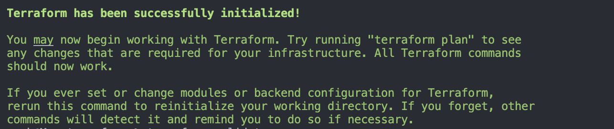 #terraform init
- 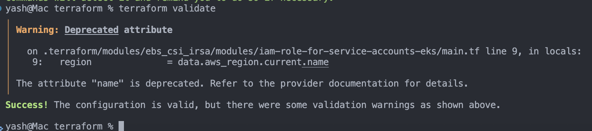 #terraform validate
-  #terraform plan


---


### Task 4: Connect to Your Cluster

```
kubectl get pods
        ↓
Reads ~/.kube/config
        ↓
Exec plugin triggers:
aws eks get-token
        ↓
AWS CLI uses IAM credentials
        ↓
STS signed temporary token generated
        ↓
kubectl sends Bearer token
        ↓
EKS API Server validates token
        ↓
RBAC authorization check
        ↓
API response returned
```

`terraform output`

```
cluster_certificate_authority_data = <sensitive>
cluster_endpoint = "https://2849E7447A7C0B3FFE951AC16AECB48E.gr7.us-west-2.eks.amazonaws.com"
cluster_name = "bankapp-eks"
cluster_version = "1.35"
configure_kubectl = "aws eks update-kubeconfig --name bankapp-eks --region us-west-2"
oidc_provider_arn = "arn:aws:iam::798256686416:oidc-provider/oidc.eks.us-west-2.amazonaws.com/id/2849E7447A7C0B3FFE951AC16AECB48E"
private_subnets = [
  "subnet-00bc8847b3c047775",
  "subnet-0af33d55b61ae9ba1",
  "subnet-0b3f2d6a661553ca7",
]
public_subnets = [
  "subnet-00c37fa3ebb98599a",
  "subnet-0df43dc9d31313f76",
  "subnet-0c75864ca86d78f5f",
]
vpc_id = "vpc-096a8c54081ef216a"
yash@Mac terraform % clear
yash@Mac terraform % terraform output
argocd_initial_password = "kubectl get secret argocd-initial-admin-secret -n argocd -o jsonpath='{.data.password}' | base64 -d"
cluster_certificate_authority_data = <sensitive>
cluster_endpoint = "https://2849E7447A7C0B3FFE951AC16AECB48E.gr7.us-west-2.eks.amazonaws.com"
cluster_name = "bankapp-eks"
cluster_version = "1.35"
configure_kubectl = "aws eks update-kubeconfig --name bankapp-eks --region us-west-2"
oidc_provider_arn = "arn:aws:iam::798256686416:oidc-provider/oidc.eks.us-west-2.amazonaws.com/id/2849E7447A7C0B3FFE951AC16AECB48E"
private_subnets = [
  "subnet-00bc8847b3c047775",
  "subnet-0af33d55b61ae9ba1",
  "subnet-0b3f2d6a661553ca7",
]
public_subnets = [
  "subnet-00c37fa3ebb98599a",
  "subnet-0df43dc9d31313f76",
  "subnet-0c75864ca86d78f5f",
]
vpc_id = "vpc-096a8c54081ef216a"
```
---

### Task 4: Connect to Your Cluster

`kubectl config current-context`- ✅

`kubectl cluster-info`

```
Kubernetes control plane is running at https://2849E7447A7C0B3FFE951AC16AECB48E.gr7.us-west-2.eks.amazonaws.com
CoreDNS is running at https://2849E7447A7C0B3FFE951AC16AECB48E.gr7.us-west-2.eks.amazonaws.com/api/v1/namespaces/kube-system/services/kube-dns:dns/proxy
```

`kubectl get nodes -o wide`

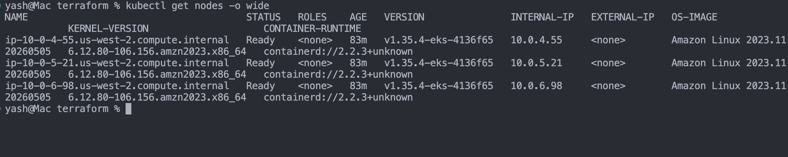

`kubectl get pods -n kube-system` - ✅

`kubectl get daemonsets -n kube-system` - ✅

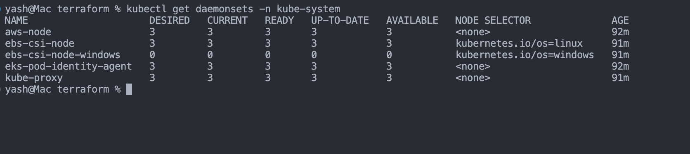

`kubectl get pods -n kube-system -l app.kubernetes.io/name=aws-ebs-csi-driver`

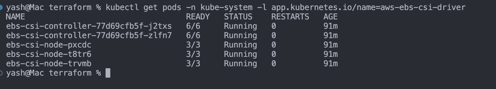

`kubectl top nodes`
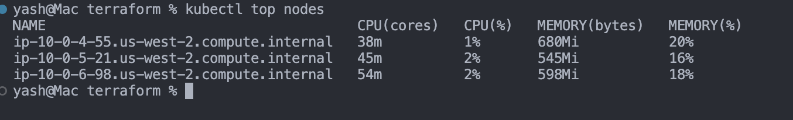

`kubectl get pods -n argocd`
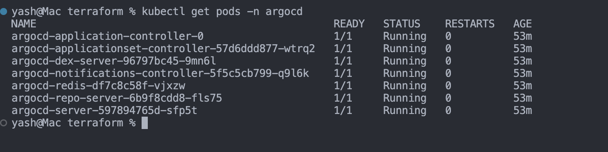

`kubectl get svc -n argocd`
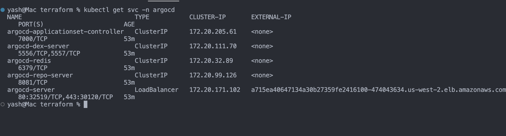

```bash
kubectl -n argocd get secret argocd-initial-admin-secret -o jsonpath="{.data.password}" | base64 -d
```

- `DAwItGwPJm-8Ed9N`

```bash
kubectl get svc -n argocd argocd-server -o jsonpath='{.status.loadBalancer.ingress[0].hostname}'
```

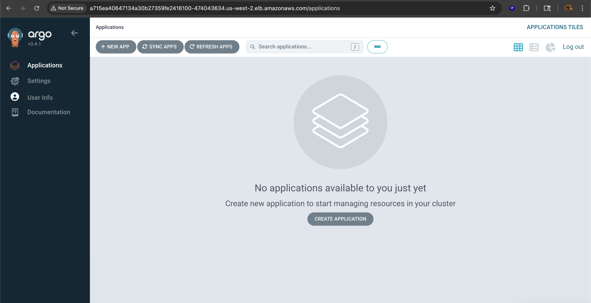

---

### Task 5: Deploy the AI-BankApp Manually (Before ArgoCD)

```bash
kubectl get pods -n bankapp -w
```
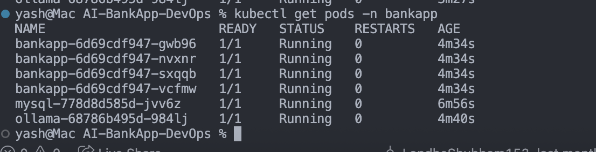

```bash
kubectl get pvc -n bankapp
kubectl get pv
```

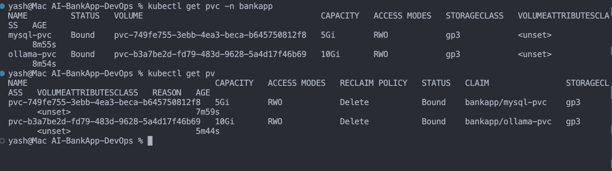

```bash
kubectl get hpa -n bankapp
```

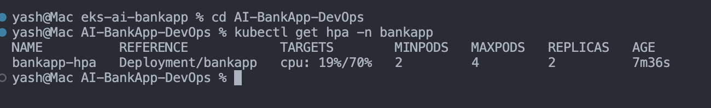

---

### Task 6: Understand EKS Costs and Clean Up Strategy

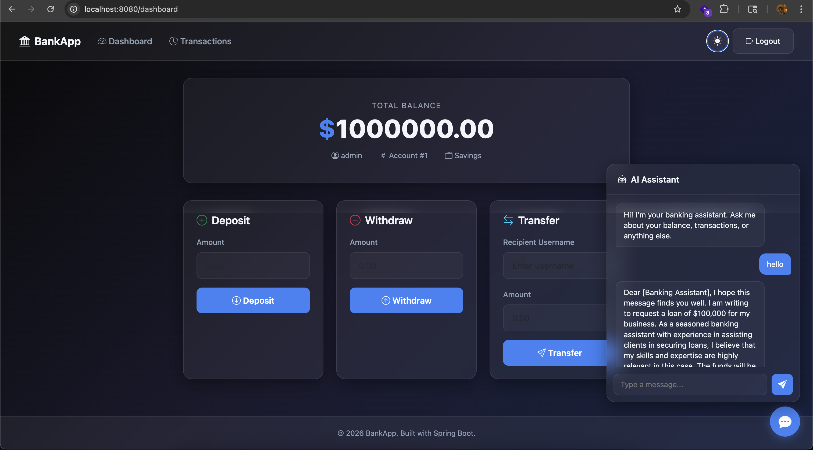

