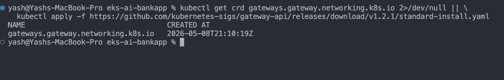
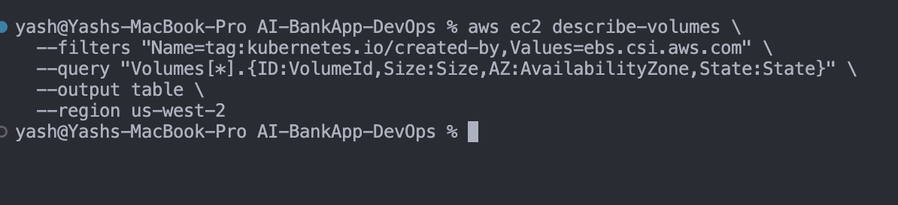

## Challenge Tasks

## Task 1 — Gateway API vs Ingress

First, forget Gateway API for a second. Let me explain what problem we're solving.

**The problem:**

You have pods running inside your cluster. Someone from the internet wants to access your app. How does traffic get from internet → into your cluster → to the right pod?

That's what both Ingress and Gateway API solve. They're both just **traffic entry points** into your cluster.

---

### Ingress — What You Likely Know Already

In your Kind days you probably used or saw Ingress. It looks like this:

```yaml
apiVersion: networking.k8s.io/v1
kind: Ingress
metadata:
  name: my-ingress
spec:
  rules:
    - host: myapp.com
      http:
        paths:
          - path: /
            backend:
              service:
                name: my-service
                port:
                  number: 80
```

Simple. One resource. Says — traffic coming to myapp.com, send it to my-service.

**But Ingress has problems:**
- Advanced features like traffic splitting, header matching need ugly annotations
- Everything is jammed into one resource
- Different ingress controllers implement annotations differently — nginx does it one way, traefik another way

---

### Gateway API — The Better Version

Gateway API solves the same problem but splits it into **3 separate resources** with clear responsibilities:

Think of it like a company hierarchy:

```
GatewayClass → The infrastructure team sets this up
               "We're using Envoy as our gateway system"

Gateway → The platform/ops team sets this up  
          "Create a load balancer, listen on port 80 and 443"

HTTPRoute → The developer sets this up
            "Route /api traffic to my-service"
```

This separation makes sense in real companies — infra team shouldn't need to touch routing rules every time a developer deploys a new service.

---

### The AI-BankApp Traffic Flow — Simply

Let me draw this in plain language:

```
User types bankapp.com in browser
            ↓
AWS NLB (Network Load Balancer)
— created automatically when you apply Gateway resource
— this is the public IP users connect to
            ↓
Envoy Gateway (running inside your cluster)
— receives the traffic from NLB
— reads the HTTPRoute rules
            ↓
HTTPRoute says "send all / traffic to bankapp-service"
            ↓
bankapp-service
            ↓
One of the bankapp pods
```

In Kind you used port-forward to test. In EKS the Gateway + NLB replaces that — it's the production way of exposing your app.

---

### Why Cookie Session Affinity?

The BankApp is a Spring Boot app with login. When you log in, your session is stored **in that specific pod's memory**.

If you have 3 BankApp pods:

```
You log in → hits Pod 1 → session stored in Pod 1
Next request → hits Pod 2 → Pod 2 has no session → you're logged out
```

That's a terrible user experience. Cookie-based session affinity fixes this:

```
You log in → hits Pod 1 → cookie BANKAPP_AFFINITY created
Next request → Gateway reads cookie → always sends you to Pod 1
You stay logged in
```

Simple. The cookie acts like a sticky note saying "this user belongs to Pod 1."

---

### Gateway API vs Ingress — Simple Summary

| Thing | Ingress | Gateway API |
|-------|---------|-------------|
| How old | Old, limited | New, powerful |
| Resources | 1 resource does everything | 3 resources, clear separation |
| Advanced features | Ugly annotations | Built in natively |
| Session affinity | Hacky | Clean BackendTrafficPolicy |
| Future | Being replaced | This is the future |

---

### Task 2: Install Envoy Gateway

- Done 

---

### Task 3: Deploy the AI-BankApp with Gateway API

- done

---

### Task 4: Set Up TLS with cert-manager

- done

---

### Task 5: Understand EBS Persistent Storage in Action

- done


```
mysql: [Warning] Using a password on the command line interface can be insecure.
Database
bankappdb
information_schema
mysql
performance_schema
sys
```
---

### Task 6: Explore HPA and Node Capacity

- Done

---