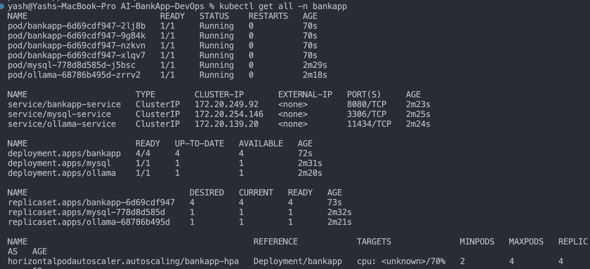
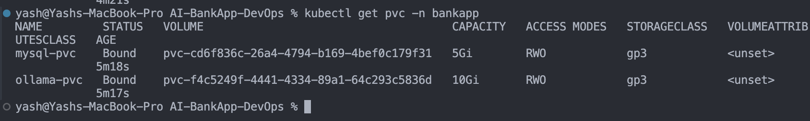
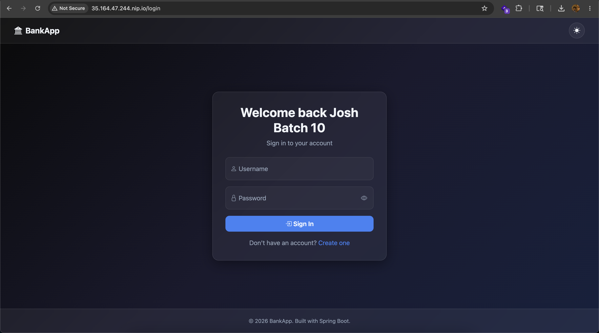
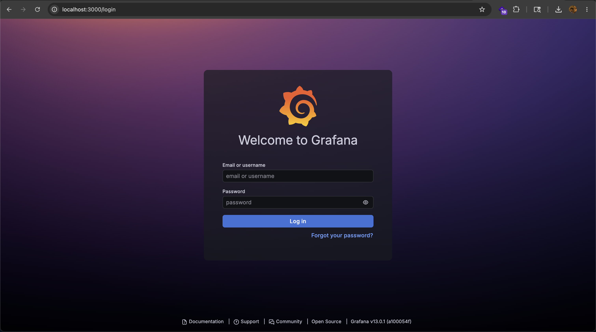
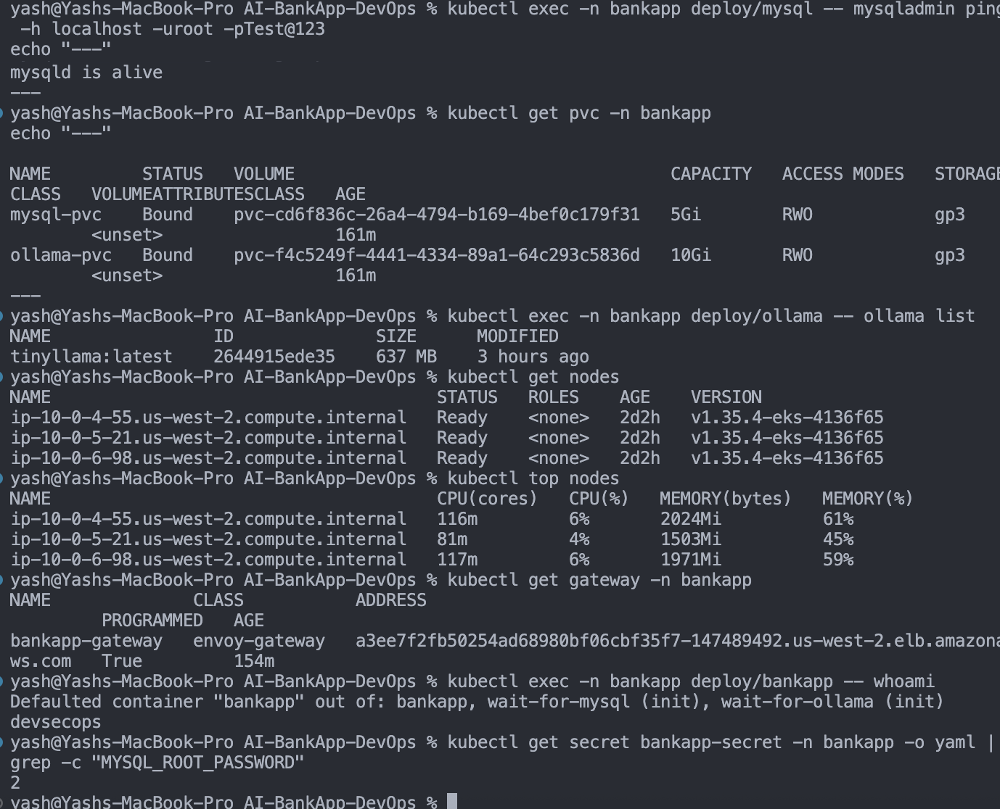

## Challenge Tasks

### Task 1: Deploy the Complete AI-BankApp Stack

```bash
kubectl get all -n bankapp
```

- 

```bash
kubectl get pvc -n bankapp
```

- 

---

### Task 2: Set Up Gateway API and Access the App

- 

---

### Task 3: Deploy the Monitoring Stack

- 
---

### Task 4: End-to-End Validation Checklist

- 

---

### Task 5: Reflect on the Full EKS Journey

- Done