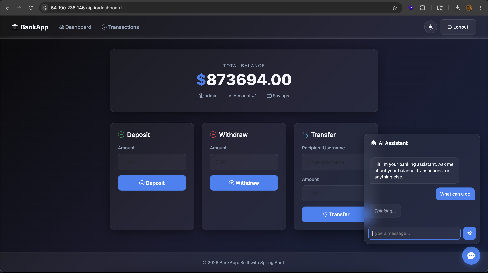
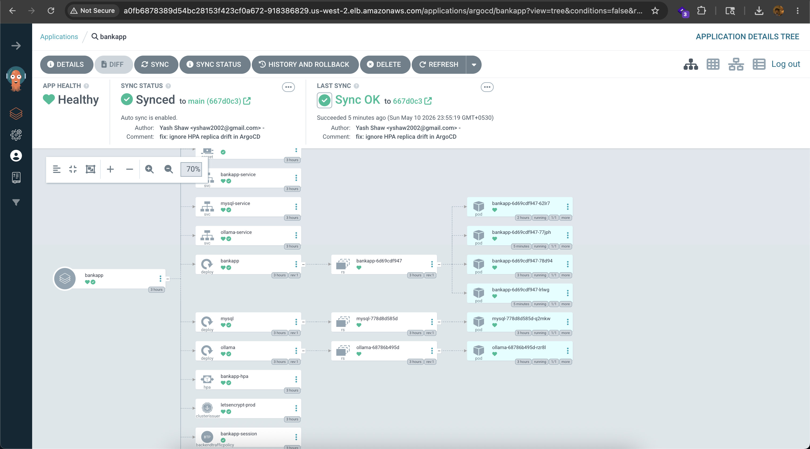
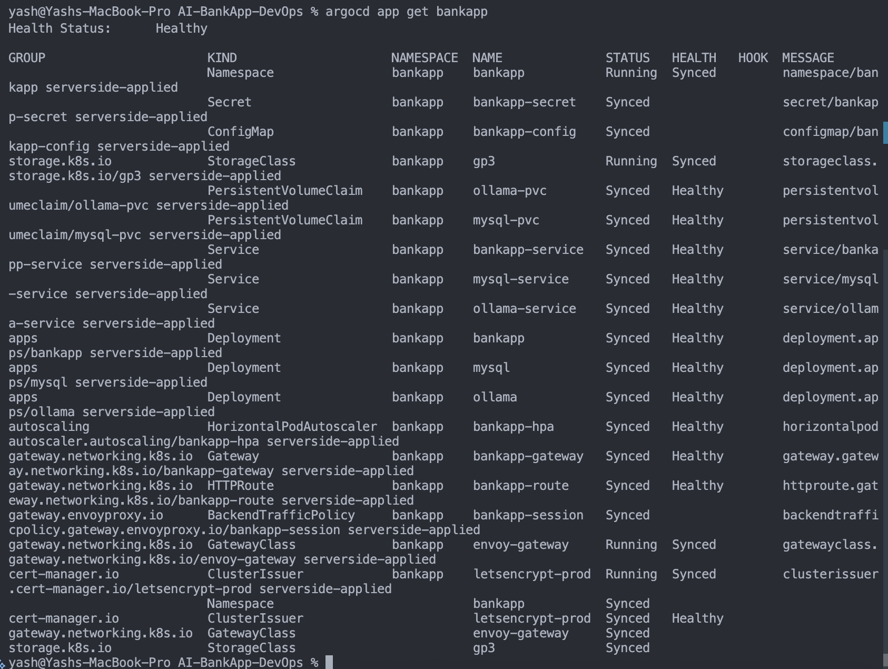
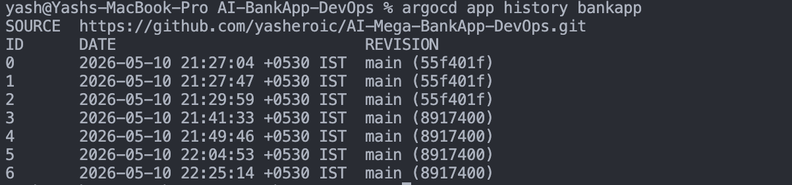
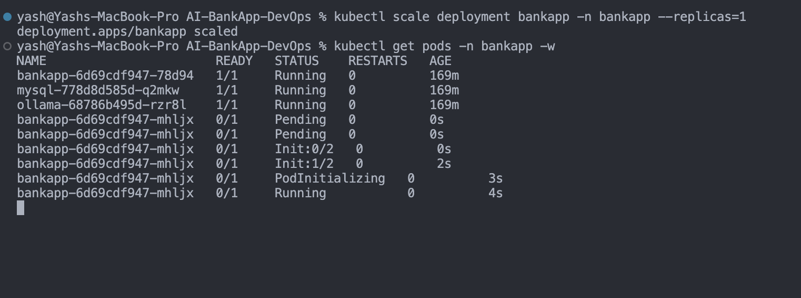
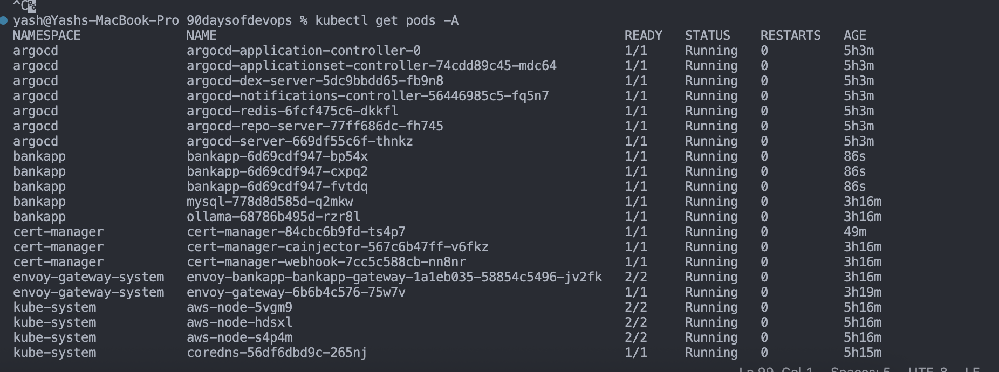

## Challenge Tasks

### Task 1: Understand GitOps

1. **What is GitOps?**
   - A deployment methodology where Git is the single source of truth for infrastructure and application state
   - An operator (ArgoCD) watches Git and ensures the live cluster matches the desired state in the repository
   - If someone changes something in the cluster manually, the operator reverts it (self-healing)
   - All changes go through Git -- pull requests, code review, audit trail

2. **GitOps vs traditional CI/CD:**

| Aspect | Traditional CI/CD | GitOps |
|--------|------------------|--------|
| Deployment trigger | CI pipeline runs `kubectl apply` | Git commit triggers sync |
| Source of truth | Pipeline scripts | Git repository |
| Drift detection | None | Continuous reconciliation |
| Rollback | Re-run pipeline or manual | `git revert` |
| Audit trail | Pipeline logs | Git history |
| Access control | Pipeline needs cluster credentials | Only ArgoCD has cluster access |
| Security | CI server has broad cluster access | Developers push to Git, never to the cluster |

3. **The AI-BankApp's GitOps flow:**
```
Developer pushes code to feat/gitops
         |
    [GitHub Actions CI]
    - Build Maven project
    - Run tests
    - Build Docker image
    - Push to DockerHub (tagged with git SHA)
    - Update image tag in k8s/bankapp-deployment.yml
    - Commit the change back to Git
         |
    [ArgoCD watches the repo]
    - Detects the new commit
    - Compares k8s/ manifests with live cluster
    - Syncs the change (rolling update)
    - BankApp pods restart with the new image
         |
    [Zero human intervention after git push]
```

4. **Four GitOps principles** (from OpenGitOps):
   - **Declarative** -- the desired state is expressed declaratively (Kubernetes YAML)
   - **Versioned and immutable** -- the desired state is stored in Git (versioned, auditable)
   - **Pulled automatically** -- agents (ArgoCD) pull the desired state, not pushed by CI
   - **Continuously reconciled** -- agents continuously compare desired vs actual and correct drift

---

### Task 2: Access ArgoCD on Your EKS Cluster

- `kubectl get secrets -n argocd`
- `kubectl edit secret argocd-initial-admin-secret`

- get password from here
-  echo "abcddsb" | base64 --decode
- we will get the password

```
'admin:login' logged in successfully
Context 'a0fb6878389d54bc28153f423cf0a672-918386829.us-west-2.elb.amazonaws.com' updated
```

---

### Task 3: Study the AI-BankApp's ArgoCD Application Manifest

- Done

---

### Task 4: Deploy the AI-BankApp via ArgoCD

- Done
- 
- 
`argocd app get bankapp`
- 


---

### Task 5: Explore ArgoCD's Live View

```bash
argocd app history bankapp
```


---

### Task 6: Test Self-Healing

1. 

`kubectl get pods -A`

- 
---
