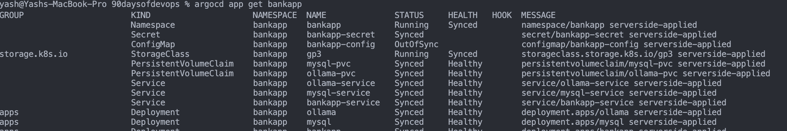
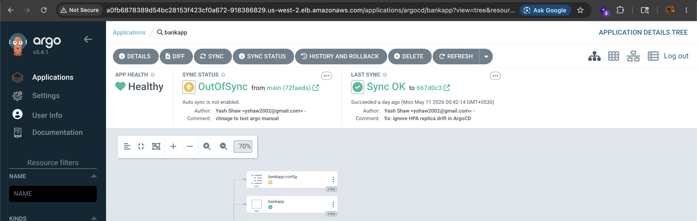
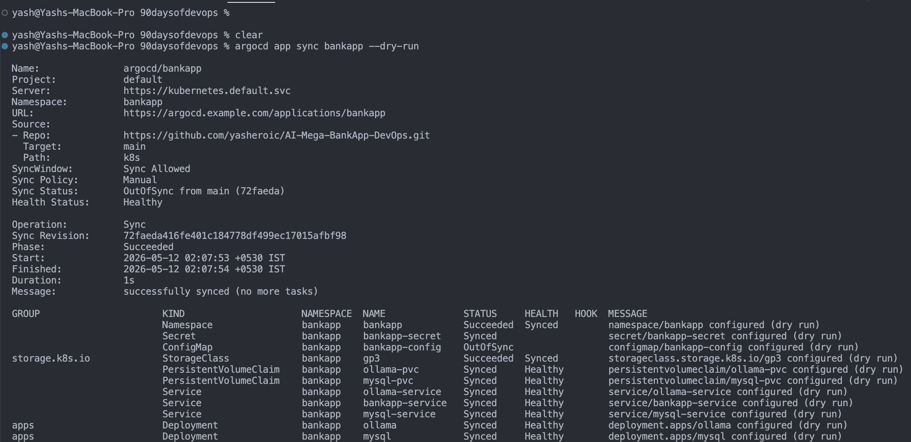
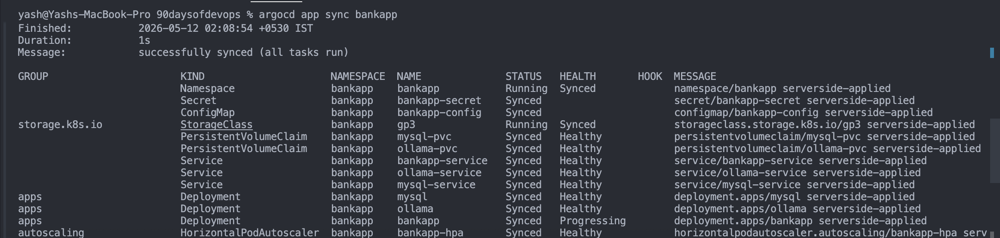
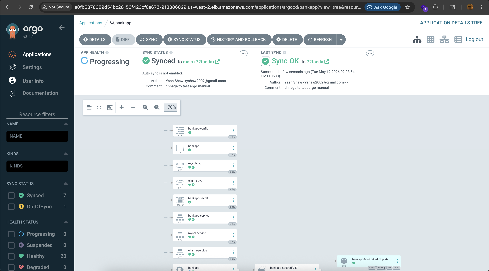
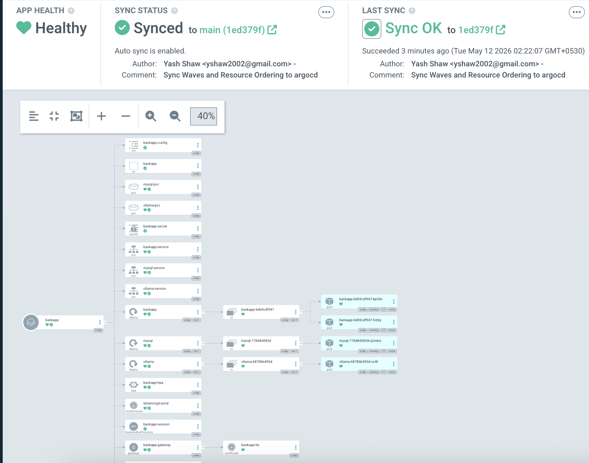
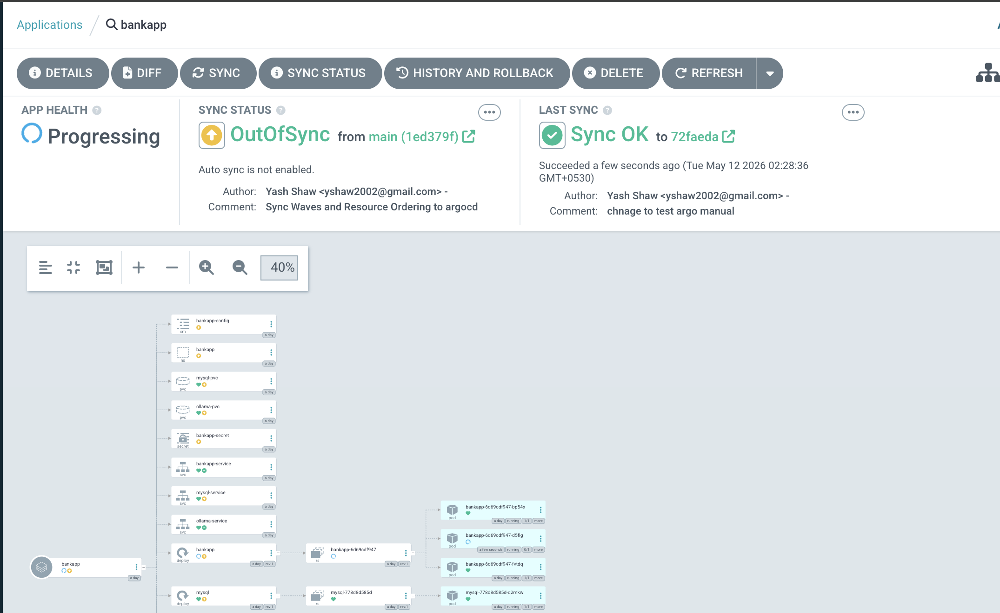
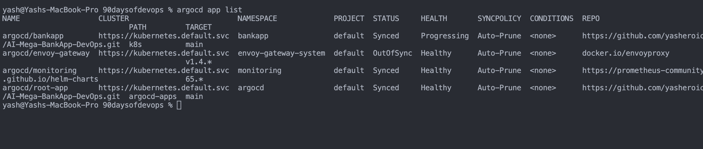
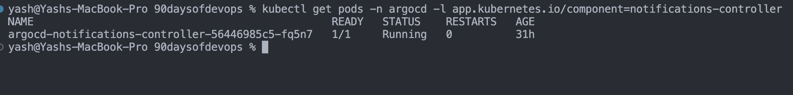

## Challenge Tasks

### Task 1: Understand Sync Strategies

`argocd app get bankapp`
- 
- 

- `argocd app diff bankapp`

```

===== /ConfigMap bankapp/bankapp-config ======
3c3
<   MYSQL_DATABASE: bankappdb
---
>   MYSQL_DATABASE: bankappdb-1
```

- `argocd app sync bankapp --dry-run`


- `argocd app sync bankapp`

- 



---

### Task 3: ArgoCD Rollbacks

`argocd app rollback bankapp 15`
- 

**Document:** What is the difference between ArgoCD rollback and `git revert`? Which is the GitOps-correct approach?

## Difference Between ArgoCD Rollback and `git revert`

### ArgoCD Rollback

`argocd app rollback` reverts the Kubernetes cluster to a previously deployed application revision stored in ArgoCD history.

Example:

```bash id="h4bz31"
argocd app rollback bankapp 15
```

### Characteristics

* Changes the **cluster state only**
* Does **NOT** modify Git history
* Fast way to restore a working deployment
* Useful during emergencies or failed deployments
* Application becomes `OutOfSync` because Git still contains the newer commit
* Temporary fix unless Git is also reverted

### Problem

Since Git remains unchanged, ArgoCD automated sync may eventually redeploy the broken version again.

---

## `git revert`

`git revert` creates a new Git commit that undoes a previous commit.

Example:

```bash id="2yjlwm"
git revert HEAD
git push
```

### Characteristics

* Changes the **Git repository**
* Preserves audit history
* Creates a new commit showing exactly what was reverted
* ArgoCD detects the new Git state and syncs the cluster automatically
* Cluster and Git remain consistent

---

## Which is the GitOps-Correct Approach?

The GitOps-correct approach is:

# ✅ `git revert`

Because in GitOps:

> **Git is the single source of truth**

The cluster should always match the desired state stored in Git.

---

## Best Practice in Production

### Emergency Recovery Flow

1. Use **ArgoCD rollback** for immediate recovery
2. Investigate the issue
3. Perform a proper `git revert`
4. Push the revert commit
5. Allow ArgoCD to sync the corrected state

---

## Summary Table

| Feature                      | ArgoCD Rollback         | `git revert`        |
| ---------------------------- | ----------------------- | ------------------- |
| Changes cluster state        | ✅                       | ✅ (via ArgoCD sync) |
| Changes Git history          | ❌                       | ✅                   |
| Immediate recovery           | ✅                       | ❌                   |
| Keeps Git as source of truth | ❌                       | ✅                   |
| Creates audit trail          | Partial                 | Complete            |
| GitOps-correct solution      | ❌                       | ✅                   |
| Best use case                | Temporary emergency fix | Permanent rollback  |

---

### Task 4: App of Apps Pattern

`argocd app list`
- 


Let me explain the purpose simply.

---

## The Problem App of Apps Solves

Right now to get your full stack running you had to manually run:

```bash
helm install envoy-gateway ...
helm install cert-manager ...
helm install monitoring ...
kubectl apply -f argocd/application.yml
```

Every time you destroy and recreate the cluster — you run all these commands again manually. That's 4-5 commands just to set up prerequisites before your app even deploys.

**What if you forgot one? What if a junior engineer rebuilds the cluster and doesn't know the order?**

---

## What App of Apps Does

Instead of you manually installing everything — ArgoCD manages ALL of it from Git.

```
You apply ONE file:
kubectl apply -f argocd-apps/root-app.yaml

Root app reads argocd-apps/ folder from GitHub
        ↓
Sees envoy-gateway.yaml → installs Envoy Gateway via Helm
Sees monitoring.yaml → installs Prometheus+Grafana via Helm  
Sees bankapp.yaml → deploys your app
        ↓
Everything installed automatically in correct order
Zero manual helm installs needed
```

---

## Specifically What Each Child App Does

**envoy-gateway.yaml:**
```
Replaces this manual command:
helm install envoy-gateway oci://docker.io/envoyproxy/gateway-helm

Now ArgoCD runs this automatically from Git
```

**monitoring.yaml:**
```
Replaces this manual command:
helm install monitoring prometheus-community/kube-prometheus-stack

Now ArgoCD runs this automatically from Git
```

**bankapp.yaml:**
```
Same as your existing application.yml
Deploys MySQL, Ollama, BankApp to bankapp namespace
```

---

## The Real World Scenario

```
Without App of Apps:
Cluster dies at 3am
On-call engineer rebuilds it
Forgets to install cert-manager
App breaks
Customers angry

With App of Apps:
Cluster dies at 3am
On-call engineer runs ONE command:
kubectl apply -f argocd-apps/root-app.yaml
Everything comes back automatically
Including envoy, monitoring, certmanager
Engineer goes back to sleep
```

---

### Task 5: ArgoCD Notifications

```
kubectl get pods -n argocd -l app.kubernetes.io/component=notifications-controller
```



```bash
kubectl get applications bankapp -n argocd -o jsonpath='{.status.operationState.message}'
```


---

### Task 6: ArgoCD Projects and RBAC

```
90daysofdevops % argocd app create restricted-test \
  --repo https://github.com/yasheroic/AI-Mega-BankApp-DevOps.git \
  --path k8s \
  --dest-server https://kubernetes.default.svc \
  --dest-namespace kube-system \
  --project bankapp-team
{"level":"fatal","msg":"rpc error: code = InvalidArgument desc = application spec for restricted-test is invalid: InvalidSpecError: application destination server 'https://kubernetes.default.svc' and namespace 'kube-system' do not match any of the allowed destinations in project 'bankapp-team'","time":"2026-05-12T02:52:47+05:30"}
yash@Yashs-MacBook-Pro 90daysofdevops % 
```

## How Projects and RBAC Prevent Teams from Affecting Other Applications

In multi-team Kubernetes environments, ArgoCD uses **Projects** and **RBAC (Role-Based Access Control)** to isolate applications, namespaces, repositories, and user permissions.

Together, they provide secure multi-tenancy and prevent accidental or unauthorized changes across teams.

---

# ArgoCD Projects

Projects act as logical boundaries around applications.

A Project defines:

* Which Git repositories are allowed
* Which clusters can be targeted
* Which namespaces applications can deploy into
* Which Kubernetes resources are permitted

Example:

```yaml id="g6jlwm"
destinations:
- namespace: bankapp
- namespace: monitoring
```

This means the `bankapp-team` project can deploy only to:

* `bankapp`
* `monitoring`

If someone tries deploying to:

* `kube-system`
* `argocd`
* another team’s namespace

ArgoCD blocks the deployment.

---

# Benefits of Projects

Projects prevent:

* Accidental deployment to production infrastructure
* One team modifying another team's workloads
* Deployments from unauthorized repositories
* Access to sensitive namespaces

This creates namespace-level and repository-level isolation between teams.

---

# RBAC (Role-Based Access Control)

RBAC controls WHAT actions users or groups can perform inside ArgoCD.

Example policy:

```yaml id="7n15gt"
policy.csv: |
  p, role:bankapp-dev, applications, get, bankapp-team/*, allow
  p, role:bankapp-dev, applications, sync, bankapp-team/*, allow
  p, role:bankapp-dev, applications, rollback, bankapp-team/*, deny
```

This policy allows developers to:

* View applications
* Sync deployments

But denies:

* Rollbacks
* Administrative actions
* Access to other projects

---

# Combined Protection

## Projects provide:

* Namespace isolation
* Repository restrictions
* Cluster deployment boundaries

## RBAC provides:

* User permission control
* Action-level security
* Team-based access management

Together they ensure:

* Teams can manage only their own applications
* Critical namespaces remain protected
* Junior developers cannot perform dangerous operations
* One team cannot accidentally impact another team’s workloads

This is essential for safely operating shared production Kubernetes clusters using GitOps.

---