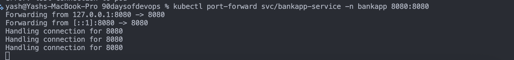
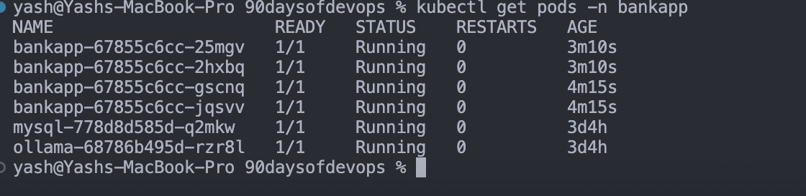
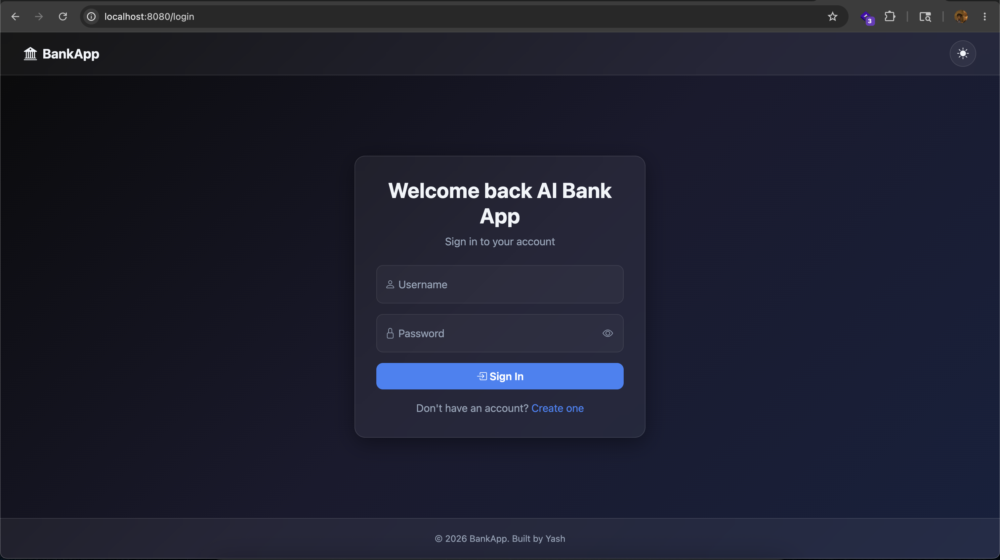
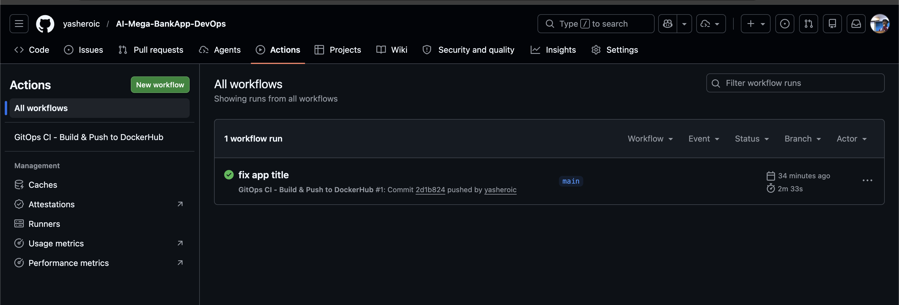
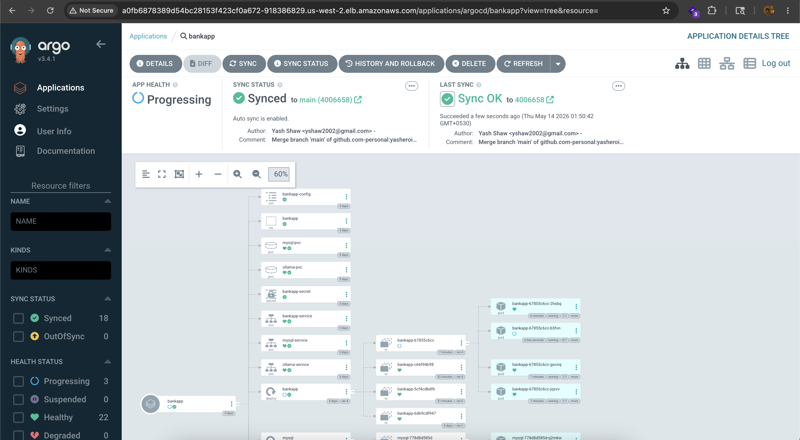
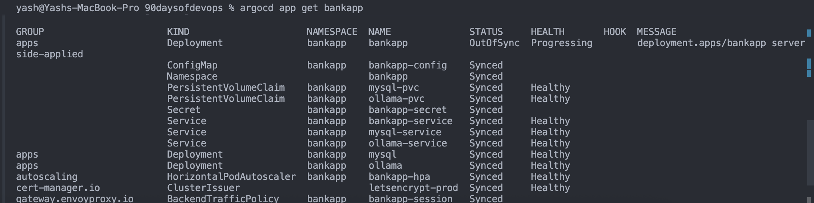
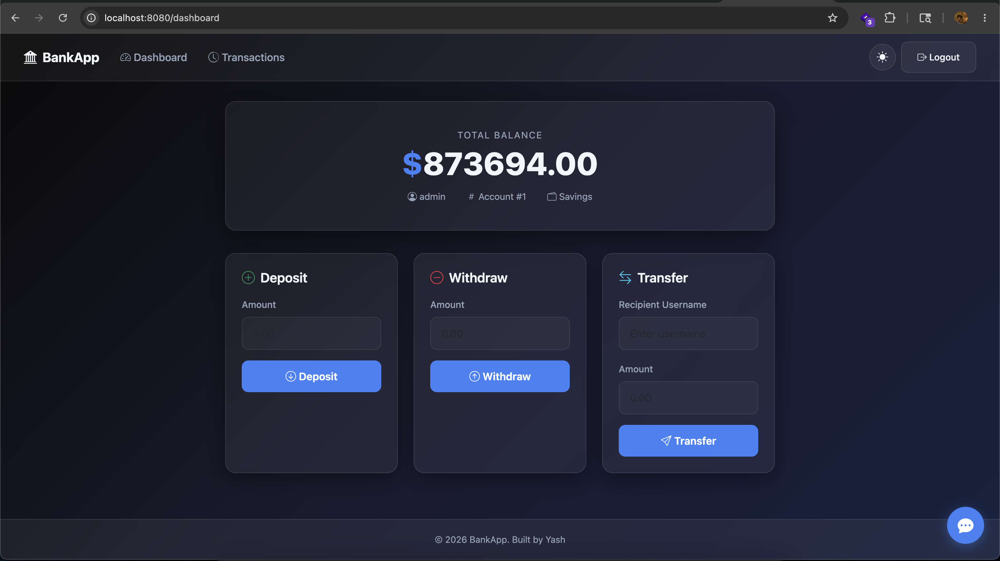
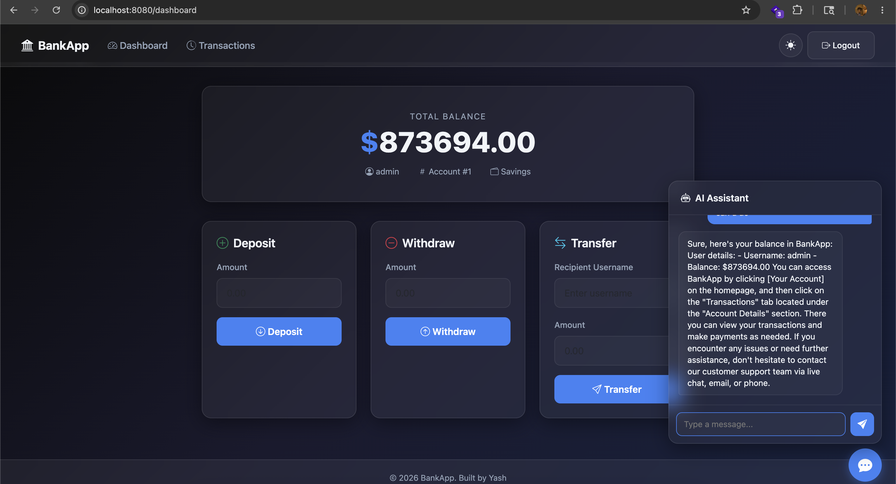

## Challenge Tasks

### Task 1: Study the AI-BankApp's GitOps CI Pipeline

```yaml
- name: Update Kubernetes deployment manifest
  run: |
    sed -i "s|image: ${{ env.DOCKERHUB_REPO }}:.*|image: ${{ env.DOCKERHUB_REPO }}:${{ steps.tag.outputs.sha_short }}|" k8s/bankapp-deployment.yml

- name: Commit updated manifest
  run: |
    git config user.name "github-actions[bot]"
    git config user.email "github-actions[bot]@users.noreply.github.com"
    git add k8s/bankapp-deployment.yml
    git diff --staged --quiet || git commit -m "ci: update bankapp image to ${{ steps.tag.outputs.sha_short }} [skip ci]"
    git push
```

**The handoff to ArgoCD:**
```
GitHub Actions commits new image tag to k8s/bankapp-deployment.yml
         |
    ArgoCD detects the new commit (within 3 minutes)
         |
    ArgoCD compares: cluster has old image, Git has new image
         |
    ArgoCD syncs: performs a rolling update
         |
    New pods start with the new image, old pods terminate
         |
    Zero downtime deployment complete
```

---

### Task 2: Set Up the Pipeline on Your Fork

- Done

### Task 3: Trigger the Full Pipeline

`kubectl port-forward svc/bankapp-service -n bankapp 8080:8080`

`kubectl get pods -n bankapp`


- 

- 
- 

### Task 4: Test Drift Detection and Recovery

```bash
kubectl scale deployment bankapp -n bankapp --replicas=1
```

```bash
argocd app get bankapp
```



Answer these in your markdown file in your own words. Here's what to write:

---

## Scenario 1 — Manual Scale Down

```
What I did: kubectl scale deployment bankapp --replicas=1
Time to detect: within 3 minutes (default sync interval)
Time to fix: immediately after detection
Result: ArgoCD scaled back to 4 replicas automatically

What if selfHeal disabled:
ArgoCD would detect the drift and show OutOfSync
But would NOT fix it automatically
A human would need to click Sync manually
The app would run with wrong replica count until someone noticed
```

---

## Scenario 2 — Wrong Image Tag

```
What I did: kubectl set image deployment/bankapp bankapp=nginx:latest
Time to detect: within 3 minutes
Time to fix: immediately — rolling update back to correct image
Result: pods restarted with correct image from Git

What if selfHeal disabled:
Cluster would run nginx instead of bankapp
Users would see errors
Nobody would know unless someone manually checked
No automatic recovery
```

---

## Scenario 3 — Delete Service

```
What I did: kubectl delete service bankapp-service
Time to detect: within 3 minutes
Time to fix: service recreated from Git immediately
Result: zero downtime — service back before traffic impacted

What if selfHeal disabled:
Service stays deleted
App completely unreachable
Outage until someone manually applies the manifest
```

---

## The Key Point About selfHeal

Write this in your own words:

> Without selfHeal, ArgoCD is just a monitoring tool — it tells you things are wrong but doesn't fix them. With selfHeal enabled, ArgoCD is a self-healing system — the cluster always converges back to Git state automatically. In production, selfHeal is typically enabled in dev/staging and disabled in production where you want human approval before changes are applied.

---

That last sentence is interview gold — knowing WHEN to use selfHeal and when not to shows production maturity.

Now finish Task 4 tests, write the markdown, and run terraform destroy. You're one step away from completing the entire course.


---

### Task 5: Reflect on the Complete DevOps Pipeline

- Done



### Task 6: Complete Teardown

**Map the 3-day ArgoCD journey:**

| Day | What You Built |
|-----|---------------|
| 84 | ArgoCD setup, first GitOps deploy, self-healing |
| 85 | Sync waves, rollbacks, App of Apps, notifications, RBAC |
| 86 | Full CI/CD pipeline, code-to-production, drift detection, teardown |

---